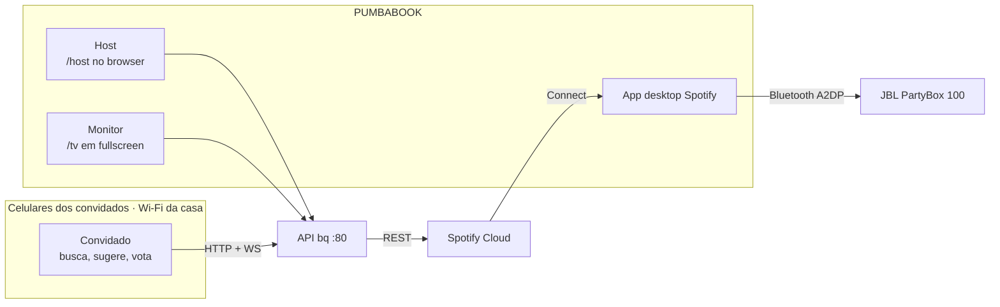

# 00 — Visão e escopo

## 1. O problema real

Numa festa, a música tem um dono acidental: quem está mais perto do notebook. Isso produz dois
resultados ruins ao mesmo tempo — o dono passa a noite atendendo pedidos em vez de participar, e
todos os outros não têm como influenciar nada além de pedir favor.

O `bq` transfere esse controle para a sala inteira, com duas regras que se equilibram:

- **qualquer pessoa pode sugerir** — mas 1 a cada 2 minutos, e a fila alterna entre pessoas, então
  entusiasmo não vira monopólio;
- **a sala pode pular** — mas precisa de 5 pessoas concordando, então uma pessoa irritada não
  vira censura.

O produto é essa tensão. Se ela for afinada errado, o app funciona e a festa fica pior: fila lenta
demais mata a sensação de participar, skip fácil demais faz ninguém ouvir uma música inteira.
É por isso que os dois limiares são **ajustáveis ao vivo** pelo `/host` ([RF-24](01-requisitos-funcionais.md))
e não constantes no código.

## 2. Quem usa

| Ator | Onde | O que faz | O que **não** consegue |
|---|---|---|---|
| **Convidado** | celular, `/` | apelido, buscar, sugerir, votar para pular, ver a fila | pular sozinho, reordenar, remover sugestão de outro, ver quem votou |
| **Host** (você) | notebook, `/host` | tudo do convidado, mais: tocar agora, pular, pausar, remover da fila, ajustar limiares, ver quem votou | — |
| **Monitor** | notebook, `/tv` | só exibe. Nenhuma interação, nenhum input | qualquer escrita |

O `/tv` **não é uma tela de leitura, é um instrumento de coordenação social.** É o que faz alguém
descobrir que existe um QR code, entender que faltam 2 votos, e perceber que a música que ele
sugeriu vai tocar em seguida. Quase todo requisito de "informar" cai nele, não no celular.

## 3. Escopo

### Dentro

- Página web para convidados, servida na rede local, acessível por IP + QR code, sem instalar nada.
- Busca de qualquer faixa do catálogo Spotify.
- Fila com justiça entre pessoas e limite de 1 sugestão a cada 2 min por convidado.
- Votação para pular a faixa atual: 5 votos, válido enquanto ela tocar.
- Playback real: a API põe a música para tocar no app desktop do Spotify no notebook.
- Tela `/tv` para o monitor.
- Painel `/host` com controle total, protegido por PIN.
- Histórico persistido do que tocou e de quem sugeriu, sobrevivendo a restart do servidor.
- **Karaokê** (M3): o convidado escolhe um vídeo do YouTube para cantar, a `/tv` o chama pelo nome
  e espera, e o vídeo toca num iframe da própria `/tv` — instrumental e letra vêm no vídeo. O
  Spotify não participa disso, e a razão é dupla e sem contorno
  ([ADR-011](adr/ADR-011-karaoke-na-tv.md)).

### Fora — e por quê

Cada item aqui foi considerado e recusado. A recusa é o conteúdo.

| Fora do escopo | Razão |
|---|---|
| **Para onde o som sai** | Decisão sua, declarada explicitamente: você conecta a JBL, e se der problema troca de caixa ou usa cabo. A API só precisa dar play. Nenhum código de roteamento de áudio, nenhum watchdog de device Windows. |
| **Acesso pela internet** | Rede local só. Sem túnel, sem domínio, sem TLS. Isso elimina de uma vez TLS, CORS, CSRF de origem externa e exposição de porta. |
| **Contas de convidado** | Apelido em cookie. Autenticação real seria mais código que o resto do app somado e resolveria um problema que não existe numa festa. |
| **Multi-festa / multi-sala** | Um servidor, uma festa, uma noite. Nenhuma noção de `party_id` em lugar nenhum. |
| **Migrações de banco** | O schema nasce e morre na mesma noite. `schema.sql` roda uma vez; se mudar durante o desenvolvimento, apaga o `.db` e recria. |
| **App nativo / PWA instalável** | O convidado abre uma URL e usa. Instalar é fricção que mata adoção em festa. |
| **Recomendação, autoplay inteligente, análise de "vibe"** | Fila vazia é silêncio, por decisão ([ADR-005](adr/ADR-005-fila-vazia-silencio.md)). |
| **Observabilidade (métricas, tracing, agregação de logs)** | Log em texto no console e no arquivo. O operador está a 2 metros do servidor. |
| **Deploy, CI, containers** | Roda em `python -m bq` na sua máquina. `start.ps1` e pronto. |
| **Park/resume no force-play** | Adiado para M2 — [ADR-008](adr/ADR-008-force-play-simples-vs-park-resume.md). |
| **Letra vinda de API** (LRCLIB, Musixmatch) | A letra vem **queimada** no vídeo de karaokê. Buscá-la fora significaria sincronizar duas fontes de tempo sobre um player que não controlamos, e letra fora de sincronia numa TV de 40 polegadas é pior que letra nenhuma ([ADR-011](adr/ADR-011-karaoke-na-tv.md)). |
| **Remoção de voz local** (Demucs e afins) | O `bq` nunca vê um sample de áudio. Precisaria baixar a faixa e custaria minutos de CPU com a pessoa esperando de pé. |
| **Votação para pular quem está cantando** | Calar alguém no microfone na frente de trinta pessoas é um objeto social diferente de pular uma música ([RF-49](01-requisitos-funcionais.md)). Some estruturalmente da união de `PlayerState`, sem flag. |

### 🔴 A fronteira que mais importa

**O app desktop do Spotify é uma dependência externa que você não controla e que precisa estar
aberta e logada.** Toda a arquitetura de playback é "dirigir um programa de terceiros por uma API na
nuvem". Isso significa que existem três estados de falha que **não são bugs do `bq`** e precisam ser
tratados como ambiente, não como código: o app fechado, o app deslogado, e o `device_id` mudando
sozinho. O [07 §3](07-integracao-spotify.md) especifica a resolução de device que absorve os três, e
o [11](11-runbook-da-festa.md) diz o que fazer na sala.

## 4. Restrições

| Restrição | Origem | Consequência de projeto |
|---|---|---|
| Spotify Premium, **uma** conta (a sua) | você | Um único token OAuth no servidor. Os convidados nunca autenticam no Spotify. Toda busca e todo play saem da sua credencial. |
| App em **Development Mode** | Spotify | Rate limit por app em janela deslizante de 30 s, valor não divulgado. Ver [07 §5](07-integracao-spotify.md). |
| Playback só funciona com Premium | Spotify | Sem plano B gratuito. Se a conta cair, não toca. |
| Windows 11, uma máquina, sem elevação garantida | ambiente | Porta 80 já verificada como livre e bindável. Sem serviço do Windows, sem tarefa agendada. |
| ~30 convidados simultâneos | evento | Dimensiona tudo. 30 WebSockets e ~2 req/s de pico é carga que um processo Python single-threaded atende com folga sobrando. Nenhuma decisão neste ERS precisa de otimização de throughput. |
| Uma noite, uso único | evento | Ver [ADR-007](adr/ADR-007-escopo-de-seguranca-reduzido.md). |
| Sem data marcada | você | O [plano](09-plano-implementacao.md) é em horas de esforço, com M0 autossuficiente — se a data aparecer amanhã, M0 sozinho já dá uma festa funcional. |

## 5. Critérios de sucesso

Não são métricas de software. São o que precisa ser verdade às 23h.

| # | Critério | Como sei que falhou |
|---|---|---|
| S1 | Música toca ininterruptamente sem ninguém tocar no notebook | Alguém foi até o notebook para resolver algo |
| S2 | Quem quer sugerir consegue em menos de 30 s do QR até "sugerida" | Alguém desistiu no meio, ou perguntou como faz |
| S3 | A fila alterna entre pessoas de forma visível | Alguém reclamou que só toca música de uma pessoa |
| S4 | Skip funciona quando a sala quer, e não quando uma pessoa quer | Uma música boa morreu; ou uma música ruim tocou inteira |
| S5 | Você participa da festa | Você passou a noite operando o `/host` |

**S5 é o critério de aceitação real do projeto.** Se todos os outros passarem e ele falhar, o `bq`
não resolveu o problema do §1 — só mudou de dono. É o que justifica o esforço em fila vazia com
saída de 1 toque, em limiares ajustáveis por slider em vez de edição de arquivo, e em o `/tv`
explicar as regras sozinho.

## 6. O que a noite produz

Depois da festa o banco `party.db` tem o histórico completo: toda faixa que tocou, em que ordem,
quem sugeriu, quanto tempo tocou, por que terminou e quem votou para pular. Isso é subproduto
gratuito do modelo de dados ([04](04-modelo-de-dados.md)) e existe sem código adicional — mas é um
motivo forte para persistir em SQLite em vez de manter em memória, e é o que a tela de histórico do
M2 consome.
