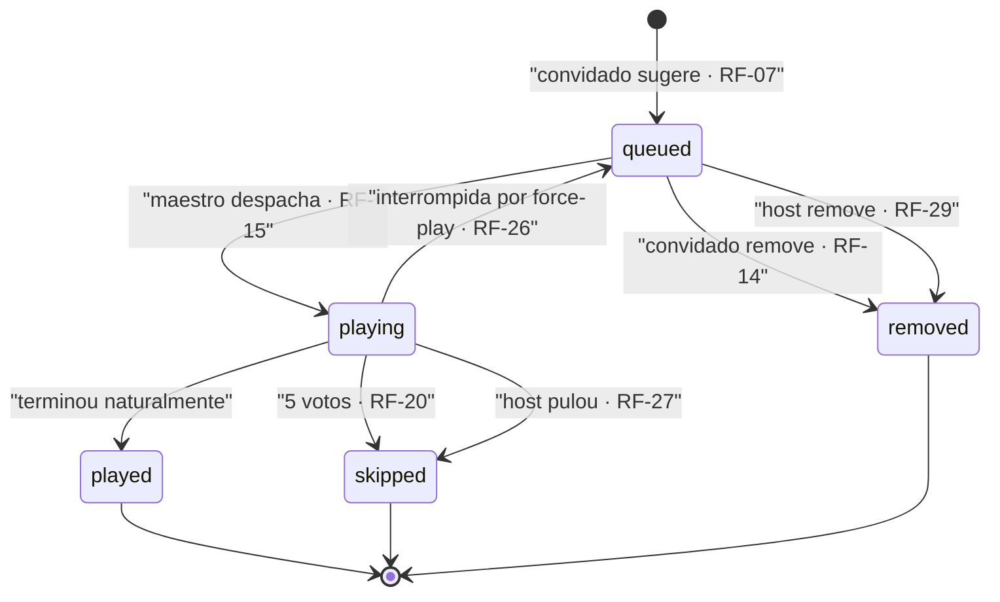
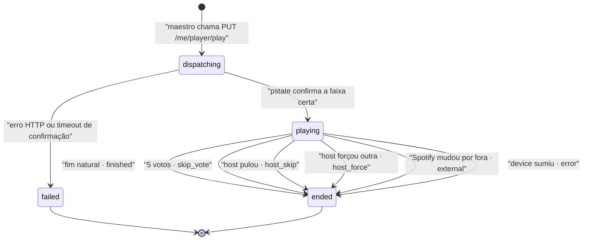
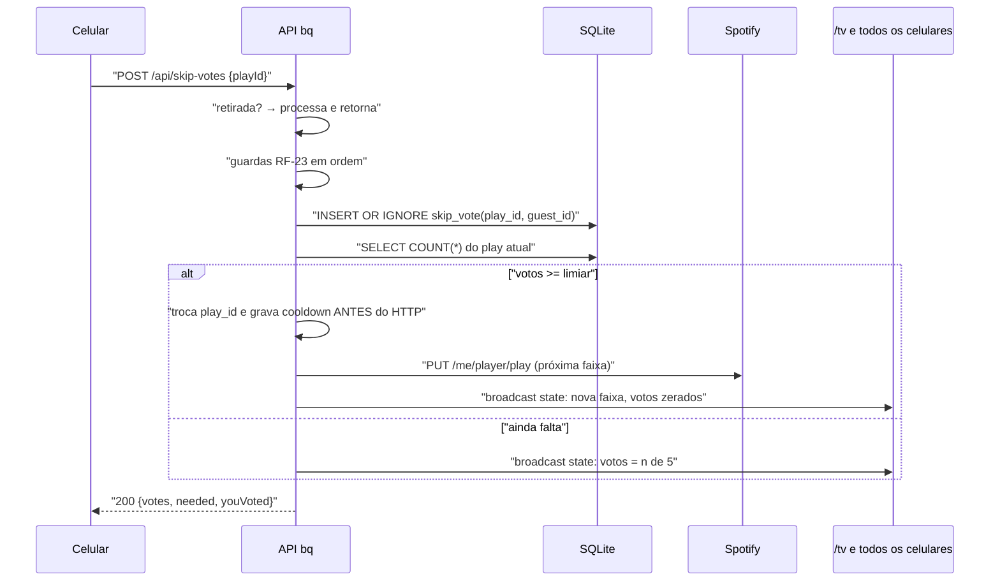

# 01 — Requisitos funcionais

Cada requisito é observável de fora: dá para verificar com um celular na mão, sem ler código.
Os códigos `RF-nn` são estáveis e citados pelas tarefas do [plano](09-plano-implementacao.md).

Coluna **M**: milestone em que o requisito passa a valer — `M0` mínimo tocável, `M1` o jogo
completo, `M2` acabamento. Ver [09](09-plano-implementacao.md).

---

## A. Identidade do convidado

| # | Requisito | M |
|---|---|---|
| **RF-01** | No primeiro acesso a `/`, o convidado informa um **apelido** de 2 a 20 caracteres. Nada mais é pedido. | M0 |
| **RF-02** | O apelido é persistido no dispositivo (cookie `bq_guest` + `localStorage`) e reconhecido em acessos seguintes, inclusive depois de fechar o browser. | M0 |
| **RF-03** | O convidado pode trocar o apelido a qualquer momento. A troca **renomeia o mesmo convidado** — não cria outro, e portanto não zera o cooldown nem reatribui sugestões já feitas. | M1 |

🔴 **RF-03 é a única defesa contra reset de cota que sobrou** depois do corte de segurança. Se
trocar o apelido criasse um convidado novo, o cooldown de 2 min ([RF-09](#c-sugestão-e-fila)) viraria
decorativo — não por má fé, mas porque a primeira pessoa que trocar de apelido descobre isso por
acidente e conta para os outros. Custa uma linha (`UPDATE` em vez de `INSERT`) e vale a pena.

## B. Busca

| # | Requisito | M |
|---|---|---|
| **RF-04** | O convidado busca faixas por texto livre. A busca retorna no máximo **10** resultados com: nome, artistas, álbum, capa e duração. | M0 |
| **RF-05** | A busca dispara automaticamente enquanto se digita, com debounce de 350 ms e mínimo de 2 caracteres. Sem botão de buscar. | M1 |
| **RF-06** | Resultados idênticos de buscas repetidas vêm de cache do servidor, sem nova chamada ao Spotify. | M1 |

**RF-06 não é otimização, é proteção de cota.** O rate limit do Spotify é **por app**, não por
usuário ([07 §5](07-integracao-spotify.md)): 30 convidados digitando ao mesmo tempo são 30
conversas competindo pelo mesmo orçamento, e o modo de falha é a busca parar de funcionar para todos
simultaneamente, no pico da festa. O cache torna as buscas repetidas — que numa festa são a maioria,
porque a sala inteira busca os mesmos 40 artistas — gratuitas.

Sem filtro de conteúdo explícito: toda faixa que o Spotify devolver é enfileirável
([ADR-007](adr/ADR-007-escopo-de-seguranca-reduzido.md)). Se algo constranger, o host pula.

## C. Sugestão e fila

| # | Requisito | M |
|---|---|---|
| **RF-07** | O convidado sugere uma faixa a partir de um resultado de busca. A sugestão entra na fila. | M0 |
| **RF-08** | A fila **alterna entre convidados**: a próxima faixa a tocar é a primeira sugestão de quem está esperando há mais rodadas, não a mais antiga em absoluto. Regra normativa em [04 §4](04-modelo-de-dados.md). | M1 |
| **RF-09** | Um convidado só pode ter uma sugestão **aceita** a cada 2 minutos. Tentativas rejeitadas não consomem a cota. | M1 |
| **RF-10** | O convidado vê quanto falta do seu cooldown, em contagem regressiva, sem precisar recarregar. | M1 |
| **RF-11** | Uma faixa **já na fila** não pode ser sugerida de novo, por ninguém. O erro diz quem já sugeriu. | M1 |
| **RF-12** | Uma faixa que **já tocou** nos últimos 90 minutos não pode ser sugerida. Depois disso pode. | M1 |
| **RF-13** | Faixas com duração acima de 7 minutos são recusadas. | M1 |
| **RF-14** | O convidado pode remover **a própria** sugestão enquanto ela ainda não começou a tocar. Remover **não** devolve a cota do cooldown. | M1 |

**RF-09 conta a partir da última sugestão aceita, e RF-14 não devolve a cota.** As duas metades da
mesma decisão: sem elas, "sugerir e remover" seria um jeito acidental de manter a fila inteira sob
controle de uma pessoa, e alguém descobre isso sem querer nos primeiros 20 minutos.

**RF-12 tem janela de 90 min, não "a noite toda".** Bloquear para sempre parece mais limpo, mas às
2h da manhã a música que abriu a festa é exatamente a que a sala quer de novo, e "essa música já
tocou hoje" seria uma recusa que ninguém entende.

### Ciclo de vida da sugestão

A transição `playing → queued` é a única que volta, e existe só por causa do force-play: a faixa da
pessoa foi cortada por decisão do host, então ela **retorna à frente da fila** e toca do início
([ADR-008](adr/ADR-008-force-play-simples-vs-park-resume.md)). O custo de não fazer isso é
tirar a vez de alguém para sempre, silenciosamente, e a pessoa nunca saber por quê.

## D. Playback

| # | Requisito | M |
|---|---|---|
| **RF-15** | Quando não há nada tocando e a fila tem itens, o sistema toca o próximo automaticamente, sem intervenção. | M0 |
| **RF-16** | Quando uma faixa termina, a próxima começa com no máximo **1 segundo** de silêncio entre elas. | M0 |
| **RF-17** | Quando a fila esvazia, o som **para** e o `/tv` exibe uma chamada em tela cheia para sugerir, com QR code. Nada toca até alguém sugerir ou o host forçar. | M1 |
| **RF-18** | Sugestão nova com a fila vazia e nada tocando começa a tocar **imediatamente**, sem esperar ciclo. | M1 |
| **RF-19** | Se o Spotify passar a tocar algo que o sistema não despachou (alguém mexeu no app ou no celular), o sistema detecta e **retoma o controle**, reafirmando a fila. Após 3 tentativas seguidas frustradas, desiste, entra em modo passivo e avisa no `/host`. | M2 |

**RF-16 é o requisito que separa "funciona" de "presta".** 1 s de silêncio a cada música é aceitável;
3 s a cada música transforma a festa numa sequência de faixas em vez de música contínua, e o efeito
é cumulativo — ninguém reclama de uma transição, todos sentem a vigésima. A técnica que atende isso
está em [03 §4](03-arquitetura.md): despacho agendado por relógio local, com o polling apenas como
rede de segurança.

**RF-19 tem limite de 3 tentativas porque a alternativa é uma guerra.** Sem o limite, o cenário é o
sistema despachando e você, do seu celular, mandando outra coisa — cada lado revertendo o outro
indefinidamente, e a sala ouvindo 4 segundos de cada música. O modo passivo é a rendição explícita,
e ela precisa aparecer no `/host` senão você não entende por que a fila parou de andar.

### Ciclo de vida do play

🔴 **`dispatching → playing` exige confirmação de estado, não o `204` do HTTP.** O `204` do
`PUT /me/player/play` significa *aceito*, não *tocando*, e a documentação do Spotify não garante
ordem entre chamadas de player. Marcar `playing` no `204` faz o sistema acreditar que a faixa começou
antes de ela existir — e como a projeção de posição ([RNF-05](02-requisitos-nao-funcionais.md)) parte
desse instante, o fim previsto sai errado e a transição do RF-16 é despachada cedo, cortando o final
de toda música. A confirmação vem do `pstate` do poller.

## E. Skip por voto

| # | Requisito | M |
|---|---|---|
| **RF-20** | **5 votos** pulam a faixa atual. O número é ajustável ao vivo pelo host ([RF-24](#f-host)). | M1 |
| **RF-21** | Um voto vale para **a execução atual** e vale enquanto ela tocar. Não expira. Quando a faixa muda, todos os votos deixam de existir — por construção, não por limpeza. | M1 |
| **RF-22** | O convidado pode **retirar** o voto. A retirada é sempre permitida, sem exceção. | M1 |
| **RF-23** | O voto é recusado, com motivo legível, quando: a faixa mudou desde que a tela carregou; ainda não tocou o mínimo (20 s ou 25 % da duração, o que for menor); falta menos de 15 s para acabar; houve skip nos últimos 45 s; ou a faixa está protegida ([RF-26](#f-host)). | M1 |
| **RF-24** | Todos os limiares desta seção e da seção C são ajustáveis no `/host` durante a festa, com efeito imediato e sem restart. | M1 |

**RF-22 não tem exceção, e a ordem de verificação importa.** Se a retirada passar pelas mesmas
guardas do RF-23, uma pessoa que votou e mudou de ideia fica **presa** no voto assim que a faixa
entrar em proteção ou em cooldown — e o contador do `/tv` continua mostrando o voto dela. A
retirada é o **primeiro** ramo do handler, antes de qualquer guarda. Contrato exato em
[05 §4](05-api-http.md).

**Por que "não expira" (RF-21) é mais simples e não menos.** A alternativa — voto com TTL — exige um
timer por voto, decisão sobre o que fazer com voto expirado durante contagem, e explicação na tela.
Amarrar o voto ao `play_id` faz a invalidação ser consequência de trocar de música: o `play_id` novo
não tem votos porque nunca teve. Zero código de expiração, e a regra cabe numa frase no `/tv`.

### Fluxo de um voto

🔴 **A troca de `play_id` e a gravação do cooldown acontecem antes da chamada HTTP ao Spotify**, que
leva 150–400 ms. Na ordem inversa, todo voto que chegar nessa janela é contado contra uma faixa que
já foi decidida: o quinto voto pula, e o sexto e o sétimo pulam **a música seguinte**, que ninguém
ouviu. É uma reação em cadeia que só aparece quando a sala está engajada — exatamente quando você
não quer descobrir.

## F. Host

O `/host` exige PIN de 4 dígitos ([RF-31](#f-host)). Todo o resto desta seção pressupõe autenticado.

| # | Requisito | M |
|---|---|---|
| **RF-25** | O host vê **os nomes** de quem votou para pular a faixa atual. Os convidados e o `/tv` veem apenas a contagem. | M1 |
| **RF-26** | O host pode **tocar uma faixa agora**, furando a fila. A faixa atual é interrompida e sua sugestão volta à frente da fila. A faixa forçada fica **protegida de voto por 90 s**, com contagem visível no `/tv`. | M1 |
| **RF-27** | O host pode pular a faixa atual imediatamente, sem votos. | M1 |
| **RF-28** | O host pode pausar e retomar o playback. | M1 |
| **RF-29** | O host pode remover qualquer sugestão da fila. | M1 |
| **RF-30** | O host pode reordenar a fila, movendo uma sugestão para a frente. | M2 |
| **RF-31** | O `/host` pede um PIN de 4 dígitos, definido em `.env`. A sessão fica válida no cookie `bq_host`. | M1 |

**A proteção de RF-26 é temporizada e visível — as duas coisas por motivos opostos.**
*Temporizada*, porque proteção permanente é o host desligando a votação em tudo que escolhe, e aí
o jogo acabou. *Visível*, porque um escudo no lugar do contador, sem contagem, lê para 30 pessoas
como exatamente isso. Os 90 s existem para o caso concreto: a música do bolo sendo pulada por 5
pessoas em 8 segundos, que é a única falha da noite visível para todos ao mesmo tempo.

**RF-31 não é segurança — é design de jogo.** Com o `/host` aberto, forçar uma música é sempre mais
rápido que convencer 4 pessoas a votar, e no momento em que duas pessoas sabem disso a fila justa e a
votação viram enfeite. O PIN custa 10 segundos seus, uma vez. Ver
[ADR-007](adr/ADR-007-escopo-de-seguranca-reduzido.md).

## G. Tela `/tv`

| # | Requisito | M |
|---|---|---|
| **RF-32** | Exibe a faixa atual grande: capa, nome, artista, quem sugeriu, e barra de progresso que anda. | M1 |
| **RF-33** | Exibe a fila **sem posições absolutas** — em ordem, sem numeração. | M1 |
| **RF-34** | Exibe o contador de skip como `n de 5`, sem nomes. Quando protegida, exibe a contagem regressiva da proteção em vez do contador. | M1 |
| **RF-35** | Exibe permanentemente o QR code e a URL de acesso, e quantas pessoas estão conectadas. | M1 |
| **RF-36** | Com a fila vazia, ocupa a tela inteira com a chamada para sugerir ([RF-17](#d-playback)). | M1 |
| **RF-37** | Legível a 3 metros: nada abaixo de 24 px, faixa atual acima de 64 px. | M1 |
| **RF-38** | Nunca exibe input, botão ou qualquer coisa clicável. É saída pura. | M1 |

**RF-33 — a fila sem números — resolve um problema antes de ele existir.** Com `#7` na tela, um
force-play não muda número nenhum e ainda faz todo mundo esperar 3 minutos e meio: parece bug e
gera pergunta. Sem números, a fila é uma ordem relativa e um force-play é só a lista deslizando.
O que **precisa** aparecer é o próximo item, e ele tem de considerar a sugestão que voltou à frente
por RF-26 — senão o `/tv` anuncia uma faixa e a sala ouve outra.

## H. Persistência e histórico

| # | Requisito | M |
|---|---|---|
| **RF-39** | Restart do servidor **não perde** a fila, o histórico, os apelidos nem os ajustes de limiar. | M0 |
| **RF-40** | Após restart, se algo estava tocando, o sistema readota o playback em curso em vez de recomeçar a faixa. | M2 |
| **RF-41** | Ao fim da festa, o banco contém: toda faixa tocada em ordem, quem sugeriu, duração real ouvida, motivo do fim e quem votou para pular cada uma. | M1 |
| **RF-42** | Uma página `/historico` apresenta o RF-41 de forma legível. | M2 |

**RF-39 é o requisito que mais barato se atende e mais caro se ignora.** Cair às 22h30 e voltar com
a fila vazia é perder o estado social da festa — as 12 pessoas que sugeriram algo teriam de sugerir
de novo, e a maioria não vai. Vem de graça com SQLite ([ADR-002](adr/ADR-002-fastapi-sqlite-stdlib.md)).

---

## Rastreabilidade

Todo `RF` acima aparece em pelo menos uma tarefa do [09 — plano de implementação](09-plano-implementacao.md)
e, quando envolve dado persistido, num invariante de [04 §5](04-modelo-de-dados.md). A tabela
inversa (tarefa → RF) está no fim do plano.
