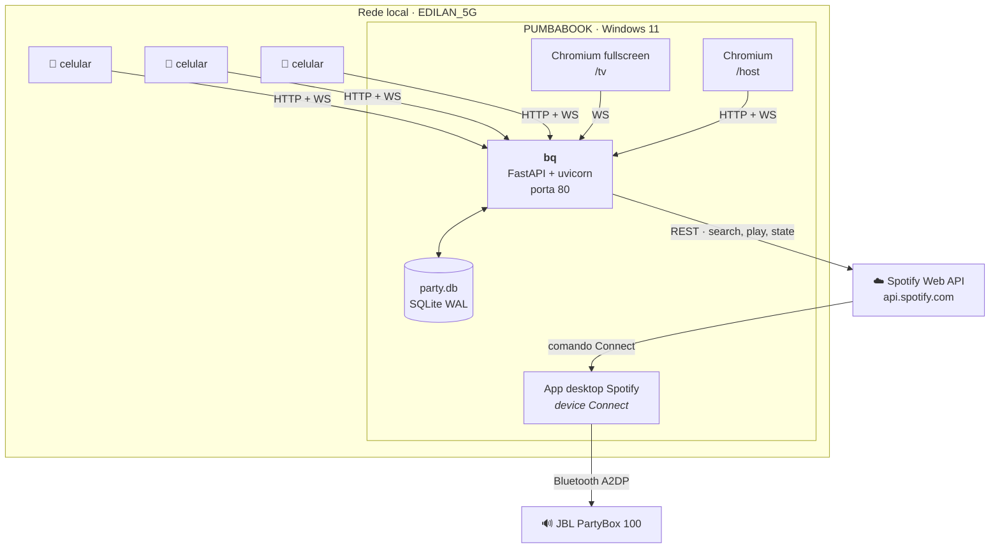
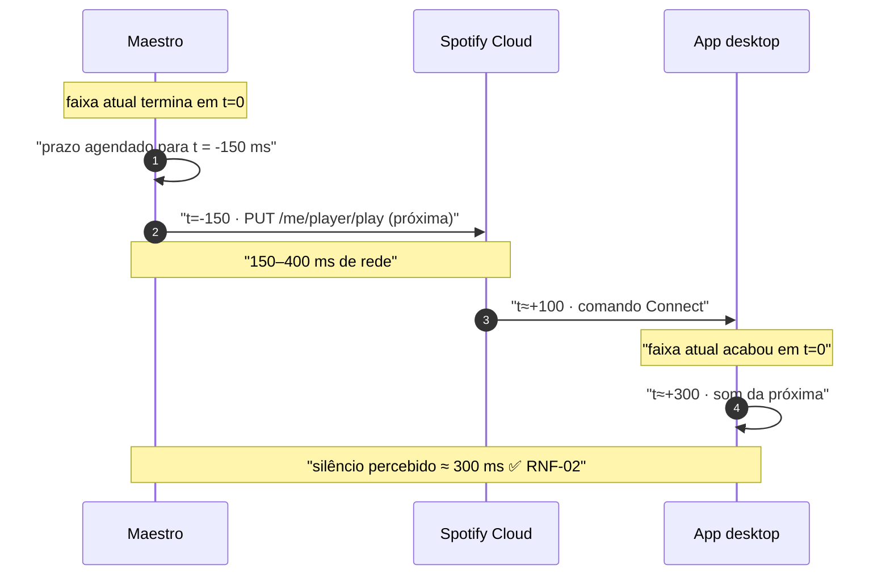
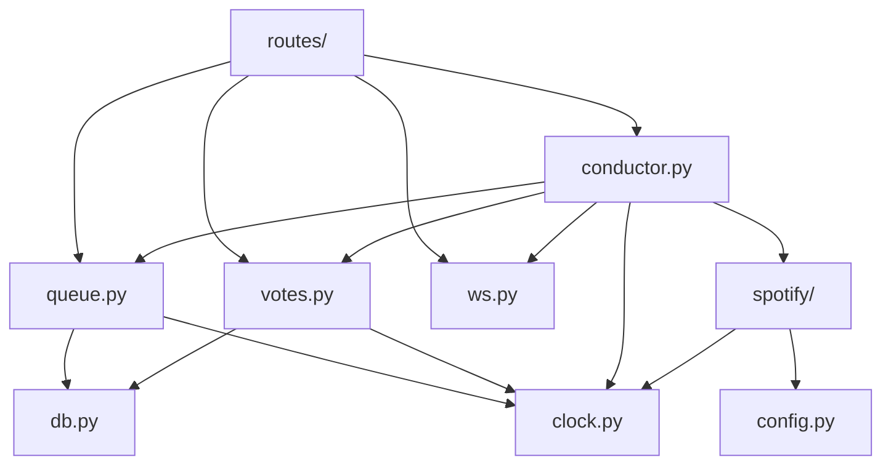

# 03 — Arquitetura

## 1. Contexto



A seta que define a arquitetura é **`CLOUD → SPOT`**: nós não tocamos áudio, nós pedimos ao Spotify
que o app desktop toque. O `bq` nunca vê um byte de áudio. Consequências:

- **nenhum código de áudio, codec, device Windows ou Bluetooth** existe neste projeto;
- em troca, **o playback depende de internet** ([RNF, riscos aceitos](02-requisitos-nao-funcionais.md#8-riscos-aceitos-explicitamente))
  e de um programa de terceiros estar aberto;
- e o estado real do playback vive **fora** do nosso processo, o que faz de "sincronizar com a
  realidade" o problema central do maestro (§4).

Racional completo em [ADR-001](adr/ADR-001-spotify-connect-vs-web-playback-sdk.md).

## 2. Stack

### Backend

| Camada | Escolha | Por quê esta |
|---|---|---|
| Runtime | **Python 3.13** | Já instalado nesta máquina (3.13.5), verificado |
| Framework | **FastAPI** + `uvicorn[standard]` | WebSocket nativo no mesmo processo e na mesma porta que o HTTP; OpenAPI gerado de graça, que é a fonte dos tipos do frontend ([ADR-006](adr/ADR-006-contratos-openapi-typescript.md)) |
| HTTP client | **httpx** (async) | Precisa ser async para não bloquear o event loop durante os 150–400 ms de cada chamada ao Spotify |
| Config | **pydantic-settings** | `.env` tipado e validado no boot, em vez de `os.environ[...]` espalhado |
| Banco | **`sqlite3` da stdlib**, modo WAL | Zero dependência, SQL explícito. Ver [ADR-002](adr/ADR-002-fastapi-sqlite-stdlib.md) |
| Estático | `StaticFiles` do próprio FastAPI | Um processo, uma porta, **nenhum CORS** |

**Quatro dependências de runtime, no total.** Isso não é minimalismo estético: é o que faz
`pip install` funcionar na primeira tentativa numa máquina Windows sem toolchain de compilação,
numa noite em que você não quer depurar wheel nenhuma. Nada aqui tem extensão C além do que já vem
com o CPython.

**Sem ORM, sem Alembic, sem Celery, sem Redis.** O schema tem 6 tabelas e nasce e morre na mesma
noite ([00 §3](00-visao-e-escopo.md)); a "fila de tarefas" é uma corrotina; o "cache" é um dict.

### Frontend

| Camada | Escolha | Por quê esta |
|---|---|---|
| Build | **Vite 7** | Sua escolha. Dev server com HMR e build estático que o FastAPI serve direto |
| Framework | **Vue 3.5** + `<script setup>` | Sua escolha |
| Linguagem | **TypeScript 5.x** `strict` + `noUncheckedIndexedAccess` | [RNF-22](02-requisitos-nao-funcionais.md) |
| Rotas | **vue-router 4**, history mode | 3 rotas, uma SPA |
| Estado | **Pinia** | Uma store alimentada pelo WebSocket é o modelo exato deste app: uma fonte, muitos leitores |
| CSS | **Tailwind v4** via plugin do Vite | Uma linha de config na v4. O `/tv` e o celular têm escalas de tipografia opostas, e utilitários resolvem isso sem manter dois CSS |
| QR | **`qrcode`** (npm) | [RF-35](01-requisitos-funcionais.md). Gerado no cliente, sem chamada de rede |
| Contratos | **`openapi-typescript`** (dev) | Tipos do HTTP derivados do pydantic, nunca escritos à mão |

**Uma SPA, três rotas — não três builds.** As telas compartilham a store, os tipos, o cliente de
WebSocket e o formatador de duração. Separar em três apps triplicaria a configuração para economizar
uns KB numa rede local.

### Ferramentas verificadas nesta máquina

Python 3.13.5 e Node 22.22.2 / npm 10.9.7 presentes. **`uv` não está instalado** — o setup usa
`venv` + `pip` da stdlib. Se quiser instalar `uv` depois, funciona igual e mais rápido; não é
requisito.

## 3. Estrutura de pastas

```
birthday-queue/
├── .docs/                     este ERS
├── api/
│   ├── pyproject.toml
│   ├── .env                   PIN, client id/secret, nome do device   (não versionar)
│   ├── .tokens.json           refresh token do Spotify               (não versionar)
│   ├── party.db               SQLite                                 (não versionar)
│   ├── scripts/
│   │   └── authorize.py       OAuth uma vez, listener em 127.0.0.1:8888
│   └── bq/
│       ├── __main__.py        uvicorn.run
│       ├── app.py             FastAPI, mounts, lifespan
│       ├── config.py          pydantic-settings
│       ├── clock.py           mono_ms / wall_ms          ← normativo, RNF-07..09
│       ├── db.py              conexão, WAL, bootstrap do schema
│       ├── schema.sql
│       ├── models.py          pydantic — os tipos que o OpenAPI expõe
│       ├── spotify/
│       │   ├── auth.py        carrega e renova o token
│       │   ├── client.py      httpx, retry, Retry-After, prioridade
│       │   ├── device.py      resolução de device por nome
│       │   └── search.py      busca + cache LRU
│       ├── queue.py           round-rank, cooldown, dedupe
│       ├── votes.py           guardas de skip
│       ├── conductor.py       o maestro                  ← §4
│       ├── ws.py              gerenciador de conexões, snapshot
│       └── routes/
│           ├── guest.py  host.py  search.py  state.py
├── web/
│   ├── package.json  vite.config.ts  tsconfig.json
│   └── src/
│       ├── main.ts  router.ts  api.ts  ws.ts
│       ├── stores/party.ts
│       ├── types/
│       │   ├── api.d.ts       GERADO do OpenAPI — não editar
│       │   └── ws.ts          união discriminada, à mão
│       ├── views/    GuestView.vue  TvView.vue  HostView.vue
│       └── components/
├── start.ps1
└── .gitignore
```

## 4. O maestro  ← o coração do sistema

Uma única task assíncrona decide o que toca. Ela existe porque o estado verdadeiro do playback está
**fora** do processo — no Spotify — e alguém precisa reconciliar o que queremos com o que é.

### 4.1 Por que uma task só, e não um timer por faixa

Um `asyncio.sleep(duração)` por faixa parece natural e é errado: quando um skip, um force-play, um
pause ou um restart acontecem, o timer continua em voo e vai disparar um despacho para uma faixa que
já não é a atual. Aí ou você rastreia e cancela timers — reinventando um scheduler — ou aceita
despachos fantasmas. Uma máquina de estados única com **um** prazo recalculado a cada passo não tem
esse problema: só existe um prazo, e ele é sempre derivado do estado atual.

### 4.2 O laço

```python
# bq/conductor.py — forma normativa
POLL_INTERVAL_MS = 1_000
DISPATCH_LEAD_MS =   150   # medir e ajustar; ver §4.4

class Conductor:
    def __init__(self, ...):
        self.current: Play | None = None
        self._wake = asyncio.Event()     # rotas acordam o maestro
        self._lock = asyncio.Lock()      # serializa TODA transição de estado
        self._poll_at_mono = 0
        self._passive = False            # RF-19: rendição após 3 tentativas

    def wake(self) -> None:
        """Chamado por qualquer rota que muda algo relevante. Nunca bloqueia."""
        self._wake.set()

    async def run(self) -> None:
        while True:
            timeout_ms = self._next_deadline_ms()
            try:
                await asyncio.wait_for(self._wake.wait(), timeout_ms / 1000)
            except asyncio.TimeoutError:
                pass
            self._wake.clear()
            async with self._lock:
                await self._step()

    def _next_deadline_ms(self) -> int:
        now = mono_ms()
        deadlines = [self._poll_at_mono]
        if self.current and self.current.state is PLAYING:
            deadlines.append(self.current.dispatch_next_at_mono)
        return max(50, min(deadlines) - now)
```

Três propriedades que essa forma garante e que valem o desenho:

- **um prazo, recalculado sempre** — não há timer órfão possível (§4.1);
- **um lock cobrindo toda transição** — as rotas de `/host` chamam `await conductor.force_play(...)`
  direto, no mesmo event loop, e não conseguem entrar no meio de um despacho;
- **`wake()` não bloqueia** — a rota que aceita uma sugestão responde ao celular em ~5 ms e deixa o
  maestro tocar depois, atendendo [RNF-01](02-requisitos-nao-funcionais.md) sem esperar o Spotify.

### 4.3 Um passo

```python
    async def _step(self) -> None:
        now = mono_ms()

        if now >= self._poll_at_mono:
            self._poll_at_mono = now + POLL_INTERVAL_MS
            snap = await self.spotify.get_playback()      # nunca levanta; RNF-10
            await self._reconcile(snap)

        if self._passive:
            return

        cur = self.current
        if cur is None:
            nxt = queue.peek_next()                       # round-rank; 04 §4
            if nxt is not None:
                await self._dispatch(nxt)                 # RF-15 / RF-18
        elif cur.state is PLAYING and now >= cur.dispatch_next_at_mono:
            nxt = queue.peek_next()
            if nxt is not None:
                await self._dispatch(nxt)                 # RF-16, antecipado
            else:
                await self._end_play(cur, "finished")     # RF-17: fila vazia → silêncio
```

O `else` do último ramo é [RF-17](01-requisitos-funcionais.md) e é o estado **esperado** às 22h30,
não uma exceção. É por isso que `PlayerState` é união discriminada e não objeto com campos opcionais
([RNF-23](02-requisitos-nao-funcionais.md)): `idle` é um estado de primeira classe, com tela própria.

### 4.4 Como o RNF-02 é atendido — o único truque real do sistema



**Sem a antecipação:** a detecção só chega no polling seguinte (até +1000 ms), o `PUT` sai aí
(+150–400), o Spotify reage (+200–600) — total 1,3 s a 2 s por transição, estourando o
[RNF-02](02-requisitos-nao-funcionais.md). A antecipação é o que põe a chamada HTTP **em voo durante
a cauda da faixa**, e o polling passa a ser rede de segurança em vez de mecanismo primário.

`DISPATCH_LEAD_MS = 150` é um palpite fundamentado e **precisa ser medido** ([tarefa em 09](09-plano-implementacao.md)).
Alto demais corta o final das músicas; baixo demais reintroduz silêncio. Duas mecânicas, uma
constante — é o único número deste projeto que merece um cronômetro.

### 4.5 Reconciliação

`_reconcile(snap)` é onde a realidade externa entra. Cada combinação tem uma resposta única:

| `snap` diz | `self.current` | Ação |
|---|---|---|
| nada tocando / sem device | `None` | nada. Estado `idle`, esperado |
| a faixa que despachamos | `DISPATCHING` | **confirma** → `PLAYING`, ancora a projeção em `mono_ms()` e `snap.progress_ms` |
| a faixa que despachamos | `PLAYING` | corrige a deriva da projeção ([RNF-05](02-requisitos-nao-funcionais.md)) |
| outra faixa | `PLAYING` | mudança externa → [RF-19](01-requisitos-funcionais.md), conta strike |
| nada tocando | `PLAYING` | acabou ou o device caiu → `_end_play(reason)` |
| a faixa anterior ainda | `DISPATCHING` há > 4 s | despacho não pegou → tenta de novo, e ao 3º desiste |

🔴 **`DISPATCHING → PLAYING` só pela confirmação, nunca pelo `204`.** O `204` significa *aceito*, e o
Spotify não garante ordem entre chamadas de player. Ancorar a projeção no instante do `204` faz o fim
previsto sair errado, o despacho de §4.4 disparar cedo e **o final de todas as músicas ser cortado** —
um bug uniforme e difícil de atribuir, porque parece "escolha de fade" e não defeito.

### 4.6 Uma única saída

**`_end_play()` é o único lugar do código que fecha um play.** Todo caminho — fim natural, 5 votos,
host pulou, host forçou, mudança externa, device perdido — passa por ele, e é ele que grava
`ended_at`, `end_reason`, atualiza a `suggestion` correspondente e emite o broadcast.

Isso é uma regra de arquitetura, não uma preferência de estilo. Com múltiplas saídas, cada
`end_reason` novo é uma chance de esquecer um dos quatro efeitos, e o esquecimento vaza de formas que
não se parecem com a causa: fila que para de andar, sugestão presa em `playing` para sempre, `/tv`
mostrando quem sugeriu a faixa errada. O brief anterior tinha essa forma de bug em 6 dos 9 motivos de
fim — e foi encontrado só depois de escrever o inventário de saídas.

### 4.7 Quem escreve o quê  — regra normativa

| Tabela | Quem escreve |
|---|---|
| `play`, `skip_vote` (a contagem que decide) | **só o maestro** |
| `suggestion.state` | **só o maestro** |
| `suggestion` (inserir, remover) | rotas |
| `guest`, `setting` | rotas |
| `track` | rotas (ao sugerir) e maestro (ao forçar) |

Ter um único escritor do estado de playback é o que permite não ter transação distribuída nenhuma: as
rotas nunca decidem o que toca, só pedem (`conductor.wake()` ou `await conductor.force_play(...)`), e o
maestro resolve dentro do lock.

## 5. Concorrência

**Um processo, um event loop, uma thread.** Não há `ProcessPoolExecutor`, não há workers, não há
`--workers 2` no uvicorn.

🔴 **`--workers > 1` quebra o sistema, não o acelera.** Cada worker teria seu próprio maestro
despachando faixas por cima do outro, seu próprio conjunto de WebSockets recebendo metade dos
broadcasts, e seu próprio cache. O estado deste app é inerentemente singleton. Fica registrado aqui
porque "aumentar workers" é o reflexo condicionado quando algo parece lento.

### SQLite síncrono num app async

`sqlite3` é bloqueante e o FastAPI é assíncrono. À escala deste projeto isso é um não-problema, com
uma regra:

> **Toda operação de banco é uma seção crítica síncrona, curta, sem `await` dentro.**

Uma escrita em SQLite local com WAL custa dezenas de microssegundos — três ordens de magnitude menos
que os 150–400 ms da chamada ao Spotify que roda logo ao lado. Bloquear o loop por 50 µs é invisível.
Bloquear por um `await` no meio de uma transação, não: seria outra corrotina entrando com a transação
meio escrita.

Conexão única, `check_same_thread=False`, `PRAGMA journal_mode=WAL`, `PRAGMA synchronous=NORMAL`,
`PRAGMA busy_timeout=3000`. Detalhes em [04 §6](04-modelo-de-dados.md).

## 6. Regras de dependência



- **`clock.py` não importa nada.** É folha. É o que permite testar tudo o que depende de tempo
  injetando um relógio falso ([10 §2](10-testes-e-validacao.md)).
- **`spotify/` não conhece o banco.** Fala HTTP e devolve dataclasses. É o que permite substituir o
  Spotify inteiro por um duplo em teste — a decisão de teste mais valiosa do projeto.
- **`queue.py` e `votes.py` não conhecem HTTP nem o Spotify.** São regras puras sobre o banco: é aí
  que moram o round-rank e as guardas de voto, os dois lugares com lógica que erra silenciosamente.
- **nada importa `routes/`.**

## 7. Configuração

`api/.env`, lido e validado no boot por `pydantic-settings`. Falha de validação **aborta o boot** com
mensagem legível — descobrir que o PIN não estava setado às 21h, com convidados chegando, é pior que
não subir às 18h.

| Chave | Exemplo | Nota |
|---|---|---|
| `SPOTIFY_CLIENT_ID` | `a1b2…` | do dashboard |
| `SPOTIFY_CLIENT_SECRET` | `c3d4…` | fica só nesta máquina |
| `SPOTIFY_REDIRECT_URI` | `http://127.0.0.1:8888/callback` | 🔴 **`localhost` é proibido pelo Spotify.** Ver [07 §2](07-integracao-spotify.md) |
| `SPOTIFY_DEVICE_NAME` | `PUMBABOOK` | nome do device, **não** o id — que não é persistente ([07 §3](07-integracao-spotify.md)) |
| `HOST_PIN` | `4271` | [RF-31](01-requisitos-funcionais.md) |
| `BIND_PORT` | `80` | verificada livre nesta máquina |
| `DB_PATH` | `party.db` | |

Limiares de jogo (5 votos, cooldown de 2 min, duração máxima, janela de repetição) **não ficam no
`.env`**: vivem na tabela `setting`, porque [RF-24](01-requisitos-funcionais.md) exige ajuste ao vivo
sem restart. `.env` é para o que não muda durante a festa.

## 8. Execução

```powershell
# setup, uma vez
cd api;  python -m venv .venv;  .\.venv\Scripts\pip install -e .
python scripts\authorize.py          # abre o browser, grava .tokens.json
cd ..\web;  npm install;  npm run build

# toda vez
.\start.ps1                          # build do web se preciso + uvicorn na :80
```

O `start.ps1` também imprime, grande, o **IP e a URL** que vão no QR code — é a primeira coisa que
você precisa na festa e a que é mais chato descobrir na hora.

Ordem de boot e o que verificar antes dos convidados: [11 — runbook](11-runbook-da-festa.md).
