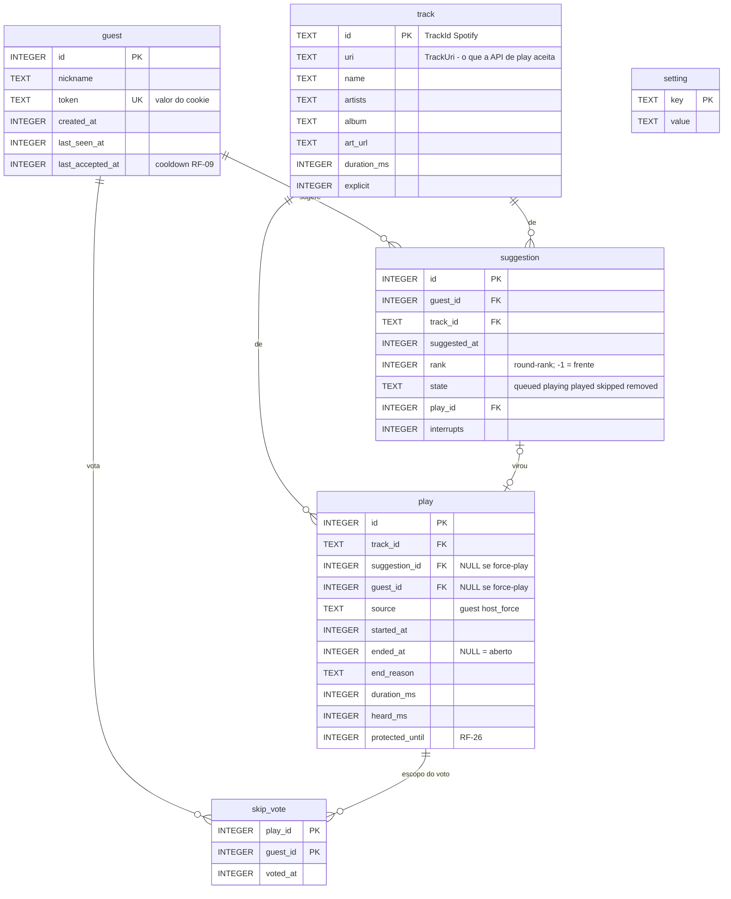

# 04 — Modelo de dados

**O DDL desta página foi executado e verificado** em SQLite 3.49.1 (o que vem no Python 3.13.5 desta
máquina). Os resultados estão em §5 e §4.3 — não são afirmações de projeto, são saída de programa.

## 1. ER



Seis tabelas. A relação que carrega o desenho é **`play ||--o{ skip_vote`**: o voto pertence a uma
*execução*, não a uma faixa nem a uma sugestão. É daí que sai [RF-21](01-requisitos-funcionais.md) —
voto sem TTL e sem código de expiração — porque trocar de faixa cria um `play` novo, e um `play` novo
não tem votos por nunca ter tido.

**`suggestion` e `play` são coisas diferentes de propósito.** Uma sugestão é uma intenção e pode nunca
tocar (removida) ou tocar duas vezes (interrompida por force-play e retomada). Um play é um evento
concreto com início, fim e motivo. Fundir as duas obrigaria a sobrescrever `started_at` na retomada e
perderia justamente o histórico que [RF-41](01-requisitos-funcionais.md) pede.

## 2. Regras de tempo nas colunas

Toda coluna `*_at` e `*_ms` é **inteiro de milissegundos**. As `*_at` são **relógio de parede**
(`wall_ms()`), porque precisam significar uma hora do dia depois de um restart. As durações
(`duration_ms`, `heard_ms`) são intervalos e vêm de subtração de parede — aceitável porque são
gravadas uma vez, no fim, e nunca usadas para agendar nada.

🔴 **Nenhum valor de `mono_ms()` é gravado no banco, nunca.** O relógio monotônico reinicia com o
processo: um `started_at = 4128371` persistido é lixo depois de reboot, e o pior é que continua
*parecendo* um timestamp válido. O estado que precisa de monotônico — a âncora da projeção de posição
— vive **só em memória**, no maestro, e é exatamente por isso que
[RF-40](01-requisitos-funcionais.md) (readotar playback após restart) precisa de um `GET /me/player`
fresco em vez de ler o banco. Ver [RNF-09](02-requisitos-nao-funcionais.md).

## 3. DDL — verificado

```sql
-- bq/core/schema.sql · executado e testado em SQLite 3.49.1
PRAGMA foreign_keys = ON;

CREATE TABLE guest (
  id               INTEGER PRIMARY KEY,
  nickname         TEXT    NOT NULL,
  token            TEXT    NOT NULL UNIQUE,          -- valor do cookie bq_guest
  created_at       INTEGER NOT NULL,
  last_seen_at     INTEGER NOT NULL,
  last_accepted_at INTEGER,                          -- RF-09: só sugestão ACEITA atualiza
  CHECK (length(nickname) BETWEEN 2 AND 20)
);

CREATE TABLE track (
  id          TEXT    PRIMARY KEY,                   -- TrackId (22 base62) | 'yt:<videoId>'
  uri         TEXT    NOT NULL,                      -- TrackUri | 'youtube:<videoId>'
  name        TEXT    NOT NULL,
  artists     TEXT    NOT NULL,                      -- já formatado "A, B" | o canal do YouTube
  album       TEXT    NOT NULL,
  art_url     TEXT,
  duration_ms INTEGER NOT NULL CHECK (duration_ms > 0),
  explicit    INTEGER NOT NULL DEFAULT 0,
  -- M3 · de onde toca. O karaokê é uma linha de `track` como qualquer outra, e isso é o que
  -- reusa `suggestion`, `play`, `_end_play`, `ux_sug_active_track`, `repeat_window_ms` e o
  -- /historico sem uma linha nova em cada. Ver ADR-011.
  provider    TEXT    NOT NULL DEFAULT 'spotify'
                      CHECK (provider IN ('spotify','karaoke'))
);

CREATE TABLE play (
  id              INTEGER PRIMARY KEY,
  track_id        TEXT    NOT NULL REFERENCES track(id),
  suggestion_id   INTEGER,                           -- NULL se force-play do host
  guest_id        INTEGER REFERENCES guest(id),       -- NULL se force-play do host
  source          TEXT    NOT NULL CHECK (source IN ('guest','host_force')),
  started_at      INTEGER NOT NULL,
  ended_at        INTEGER,                            -- NULL = play aberto
  end_reason      TEXT    CHECK (end_reason IN
                    ('finished','skip_vote','host_skip','host_force','external','error')),
  duration_ms     INTEGER NOT NULL,                  -- snapshot: a faixa pode mudar no catálogo
  heard_ms        INTEGER,
  protected_until INTEGER NOT NULL DEFAULT 0,        -- RF-26; 0 = sem proteção
  CHECK (ended_at IS NULL OR ended_at   >= started_at),
  CHECK (ended_at IS NULL OR end_reason IS NOT NULL)
);
-- INV-1: no máximo UM play aberto. O índice é a garantia, não a convenção.
CREATE UNIQUE INDEX ux_play_open ON play((ended_at IS NULL)) WHERE ended_at IS NULL;

CREATE TABLE suggestion (
  id           INTEGER PRIMARY KEY,
  guest_id     INTEGER NOT NULL REFERENCES guest(id),
  track_id     TEXT    NOT NULL REFERENCES track(id),
  suggested_at INTEGER NOT NULL,
  rank         INTEGER NOT NULL,                     -- §4;  -1 = volta à frente (RF-26)
  state        TEXT    NOT NULL CHECK (state IN
                 ('queued','playing','played','skipped','removed')),
  play_id      INTEGER REFERENCES play(id),
  interrupts   INTEGER NOT NULL DEFAULT 0,           -- quantas vezes foi interrompida
  -- M3 · karaokê. Chamamos e ninguém veio: a 1ª falta manda para o fim da fila, a 2ª tira.
  noshows      INTEGER NOT NULL DEFAULT 0,
  -- 🔴 PAREDE e persistido, não estado do maestro. Se a fila só tem este karaokê,
  -- `send_to_back` não muda nada e o turno reabriria num laço — a mesma pessoa chamada a cada
  -- N segundos, a noite toda. `queue.ordered()` trata um karaokê com
  -- `agora - noshow_at < karaoke_wait_ms` como não elegível. NULL = nunca faltou.
  noshow_at    INTEGER,
  CHECK (state <> 'playing' OR play_id IS NOT NULL)  -- INV-6
);
CREATE INDEX        ix_sug_queue        ON suggestion(state, rank, suggested_at);
-- INV-2: no máximo UMA sugestão tocando.
CREATE UNIQUE INDEX ux_sug_one_playing  ON suggestion(state)    WHERE state = 'playing';
-- RF-11 / INV-3: uma faixa não pode estar duas vezes na fila (nem na fila e tocando).
CREATE UNIQUE INDEX ux_sug_active_track ON suggestion(track_id) WHERE state IN ('queued','playing');

CREATE TABLE skip_vote (
  play_id  INTEGER NOT NULL REFERENCES play(id),
  guest_id INTEGER NOT NULL REFERENCES guest(id),
  voted_at INTEGER NOT NULL,
  PRIMARY KEY (play_id, guest_id)                    -- um voto por pessoa por execução
) WITHOUT ROWID;

CREATE TABLE setting (key TEXT PRIMARY KEY, value TEXT NOT NULL);
```

### 3.1 Índices parciais como invariantes  — a decisão mais rentável desta página

Quatro regras de negócio estão gravadas no **schema**, não no código:

| Regra | Mecanismo |
|---|---|
| No máximo um play aberto | `ux_play_open` |
| No máximo uma sugestão tocando | `ux_sug_one_playing` |
| Uma faixa não repete na fila ([RF-11](01-requisitos-funcionais.md)) | `ux_sug_active_track` |
| Sugestão tocando tem `play_id` | `CHECK` |

O ganho não é elegância: é que **a violação passa a ser impossível em vez de improvável**. O modo de
falha que isso mata é específico e caro — um bug num caminho de saída deixando uma sugestão presa em
`playing` para sempre, e a fila silenciosamente parando de andar no meio da festa, com todos os
indicadores verdes. Com o índice, o próprio `INSERT`/`UPDATE` errado levanta `IntegrityError` no
desenvolvimento, na primeira vez.

`ux_play_open` usa uma **expressão** (`(ended_at IS NULL)`) e não a coluna. A forma óbvia,
`ON play(ended_at) WHERE ended_at IS NULL`, **não funciona**: em índice UNIQUE do SQLite os `NULL`
são distintos entre si, então ela permitiria infinitos plays abertos. Indexar a expressão faz todas as
linhas do índice valerem `1`, e aí a unicidade morde. Verificado:

```
PASS INV-1 segundo play aberto e recusado -> UNIQUE constraint failed: index 'ux_play_open'
PASS INV-1 apos fechar o primeiro, o segundo entra
```

**Como usar isso nas rotas:** faça a pré-checagem em `SELECT` para produzir a mensagem boa
(*"Ana já sugeriu essa"* — [RF-11](01-requisitos-funcionais.md)) e trate `IntegrityError` como `409`
genérico de rede de segurança. A constraint garante a correção; o `SELECT` garante a educação. Não
faça parsing do texto do erro para decidir a mensagem — ele é instável entre versões do SQLite.

### 3.2 Seeds da tabela `setting`

Estes valores são [RF-24](01-requisitos-funcionais.md) — ajustáveis ao vivo pelo `/host`, por isso
estão no banco e não no `.env` ([03 §7](03-arquitetura.md)).

```sql
INSERT INTO setting(key, value) VALUES
  ('skip_votes_needed',   '5'),        -- RF-20
  ('suggest_cooldown_ms', '120000'),   -- RF-09 · 2 min
  ('max_duration_ms',     '420000'),   -- RF-13 · 7 min
  ('repeat_window_ms',    '5400000'),  -- RF-12 · 90 min
  ('protect_ms',          '90000'),    -- RF-26 · 90 s
  ('skip_cooldown_ms',    '45000'),    -- RF-23
  ('min_remaining_ms',    '15000'),    -- RF-23
  ('min_heard_ms',        '20000'),    -- RF-23 · literal; o teto de 25% saiu (ADR-004 §Revisão)
  ('paused',              '0');
```

## 4. Round-rank — normativo

A justiça de [RF-08](01-requisitos-funcionais.md) sai de **duas queries**. Não há ledger, não há
tempo virtual, não há estado global mutável, e nada a reconstruir depois de um restart — porque a
ordenação é função apenas de colunas gravadas nas linhas.

### 4.1 Inserir

```sql
-- rank = quantas sugestões AINDA NÃO TOCADAS este convidado já tinha neste instante
INSERT INTO suggestion (guest_id, track_id, suggested_at, rank, state)
SELECT :guest_id, :track_id, :now,
       (SELECT COUNT(*) FROM suggestion
         WHERE guest_id = :guest_id AND state = 'queued'),
       'queued';
```

### 4.2 Próxima a tocar

```sql
SELECT s.id, s.guest_id, s.track_id, t.uri, t.duration_ms
  FROM suggestion s JOIN track t ON t.id = s.track_id
 WHERE s.state = 'queued'
 ORDER BY s.rank ASC, s.suggested_at ASC
 LIMIT 1;
```

É isso. `rank` é a "rodada" em que a sugestão participa; `suggested_at` desempata dentro da rodada.
Todos os primeiros pedidos de todo mundo estão no `rank 0` e tocam antes de qualquer segundo pedido.

### 4.3 Verificação empírica

Executado com o DDL de §3:

```
cenario 1: Ana enfileira 3 antes de qualquer outro chegar
  Ana sugere T01 -> rank 0 | T02 -> rank 1 | T03 -> rank 2
  Bru sugere T04 -> rank 0 | Caio sugere T05 -> rank 0
  ordem de execucao: Ana Bru Caio Ana Ana            PASS

cenario 2: a 1a de quem chega tarde vem antes da 2a de quem ja estava
  ordem de execucao: Ana Dani Ana Ana                PASS

cenario 3: entusiastas empatados intercalam 1 a 1
  ordem de execucao: Ana Bru Caio Dani Ana Bru       PASS (nunca dois seguidos)

cenario 4: rank = -1 (interrompida por force-play) volta a frente
  ordem de execucao: Ana Caio Dani                   PASS

cenario 5: sem inanicao — 4 pessoas repondo a fila a cada execucao, 40 execucoes
  distribuicao: {Ana: 10, Bru: 10, Caio: 10, Dani: 10}
  maior intervalo entre duas vezes da mesma pessoa: 4
  PASS (spread 0)
```

O cenário 5 é o que importa: sob contenção sustentada, distribuição **perfeitamente igual** e
intervalo máximo igual ao número de pessoas. É o comportamento de round-robin ideal, e é o que
[S3](00-visao-e-escopo.md#5-critérios-de-sucesso) pede.

**O cenário 2 corrige uma intuição errada** que vale registrar, porque parece bug e não é. Quando
Dani chega, a fila da Ana é `A1(r0) A2(r1) A3(r2)`. Dani entra com `r0` e toca em **segundo**, não em
primeiro: `A1` também é `r0` e foi pedida antes, então mantém a vez. O que a justiça garante é que
Dani venha antes da **segunda** da Ana — e vem. Round-robin não é "quem chegou por último passa na
frente"; é "ninguém repete antes de todos jogarem".

### 4.4 Duas propriedades e um limite honesto

- **Recém-chegado nunca é punido.** Entra sempre em `rank 0`, na frente de todo `rank ≥ 1`, sem
  precisar de nenhuma noção de "hora de entrada na festa".
- **Sobrevive a restart de graça.** `rank` está na linha. [RF-39](01-requisitos-funcionais.md) sai sem
  código de recuperação — que é a vantagem concreta sobre WFQ, cujo `V` global teria de ser persistido
  e reconstruído ([ADR-003](adr/ADR-003-round-rank-vs-wfq.md)).
- **Limite:** `rank` não é ponderado por duração. Quem enfileira 6 minutos e quem enfileira 3 gastam
  uma vez cada. O `max_duration_ms` de 7 min ([RF-13](01-requisitos-funcionais.md)) limita o abuso a
  no máximo 2,3× — e a alternativa custaria o ledger inteiro do WFQ.
- **`rank` pode ter buracos** (remover uma sugestão deixa `0, 2` sem o `1`). Inofensivo: só a ordem
  relativa é usada, nunca a contiguidade nem o valor absoluto.

## 5. Invariantes

Toda query abaixo **deve devolver 0**. Rodam em conjunto no `/host` (M2) e no teste
([10 §3](10-testes-e-validacao.md)). Verificadas contra o DDL de §3.

| # | Invariante | Query |
|---|---|---|
| **INV-1** | No máximo um play aberto | `SELECT MAX(0, COUNT(*)-1) FROM play WHERE ended_at IS NULL` |
| **INV-2** | No máximo uma sugestão tocando | `SELECT MAX(0, COUNT(*)-1) FROM suggestion WHERE state='playing'` |
| **INV-3** | Faixa não repete entre fila e tocando | `SELECT COUNT(*) FROM (SELECT track_id FROM suggestion WHERE state IN ('queued','playing') GROUP BY track_id HAVING COUNT(*)>1)` |
| **INV-4** | Play aberto de convidado tem sugestão tocando | `SELECT COUNT(*) FROM play p WHERE p.ended_at IS NULL AND p.source='guest' AND NOT EXISTS (SELECT 1 FROM suggestion s WHERE s.play_id=p.id AND s.state='playing')` |
| **INV-5** | Todo voto aponta para um play existente | `SELECT COUNT(*) FROM skip_vote v WHERE NOT EXISTS (SELECT 1 FROM play p WHERE p.id=v.play_id)` |
| **INV-6** | Sugestão tocando tem `play_id` | garantido por `CHECK`; query: `SELECT COUNT(*) FROM suggestion WHERE state='playing' AND play_id IS NULL` |
| **INV-7** | Play fechado é coerente | `SELECT COUNT(*) FROM play WHERE ended_at IS NOT NULL AND (heard_ms IS NULL OR heard_ms > duration_ms + 2000 OR ended_at < started_at)` |

Saída da verificação: `INV-1..7 -> 0` em todos.

**A tolerância de `+2000` no INV-7 é deliberada.** `heard_ms` vem de subtração de relógio de parede e
o `ended_at` é gravado depois de a próxima faixa já ter sido despachada
([03 §4.4](03-arquitetura.md)); um `heard_ms` alguns centésimos maior que `duration_ms` é normal, não
corrupção. Sem a folga, o invariante dispararia falso positivo em toda transição bem-sucedida — e um
invariante que grita sem motivo é pior que nenhum, porque treina você a ignorá-lo.

**INV-4 exclui `source='host_force'` de propósito:** um force-play não nasce de sugestão nenhuma, e
por isso tem `suggestion_id` e `guest_id` nulos ([RF-26](01-requisitos-funcionais.md)).

## 6. Conexão e PRAGMAs

```python
# bq/core/db.py
conn = sqlite3.connect(DB_PATH, check_same_thread=False, isolation_level=None)
conn.row_factory = sqlite3.Row
conn.executescript("""
  PRAGMA journal_mode = WAL;      -- leitor não bloqueia escritor
  PRAGMA synchronous  = NORMAL;   -- fsync no checkpoint, não em cada commit
  PRAGMA foreign_keys = ON;       -- OFF é o default do SQLite; sem isto as FKs são decorativas
  PRAGMA busy_timeout = 3000;
""")
```

- `isolation_level=None` desliga o autocommit implícito do driver Python; transações são explícitas
  com `BEGIN`/`COMMIT`. Ver a regra de seção crítica em [03 §5](03-arquitetura.md).
- 🔴 `PRAGMA foreign_keys` é **`OFF` por padrão** no SQLite, por compatibilidade histórica, e precisa
  ser ligado **em cada conexão**. Sem essa linha todos os `REFERENCES` do §3 não fazem nada — e o
  schema *parece* estar protegido.
- `synchronous = NORMAL` é seguro aqui: o pior caso é perder os últimos milissegundos num corte de
  energia, e a máquina fica ligada a noite toda ([00 §4](00-visao-e-escopo.md)).

**Bootstrap:** se `party.db` não existe, roda `schema.sql` e os seeds. Se existe, usa como está.
Sem migrações — mudou o schema durante o desenvolvimento, apaga o arquivo
([00 §3](00-visao-e-escopo.md)).
