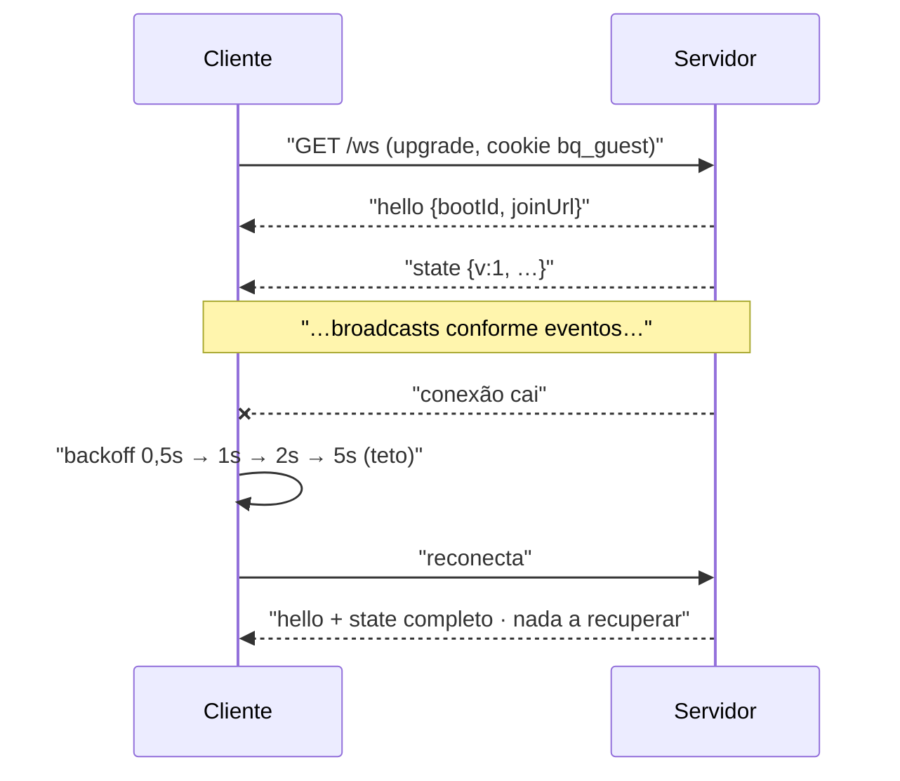

# 06 — Realtime / WebSocket

Um endpoint: `GET /ws` (upgrade). **Fluxo servidor→cliente apenas.** Nenhuma ação de usuário
atravessa o WebSocket ([ADR-009](adr/ADR-009-acoes-por-http-nao-websocket.md)).

## 1. Por que só broadcast

Ações por WebSocket exigiriam correlacionar pedido e resposta à mão, reinventar códigos de status e
tratar "socket caiu no meio da sugestão". Por HTTP, isso já existe: `429` com `Retry-After`, corpo de
erro tipado, retry do browser. O WebSocket faz a única coisa que HTTP faz mal — empurrar mudança para
30 telas ao mesmo tempo.

Consequência prática: **o cliente nunca envia nada**. Sem parser de mensagem de entrada, sem
autorização por mensagem, sem validação de payload no socket. O `/tv`, que por
[RF-38](01-requisitos-funcionais.md) é saída pura, abre exatamente o mesmo socket que os outros.

## 2. Snapshot completo, sem replay

Cada broadcast carrega **o estado inteiro**: faixa atual, fila, votos, settings, contagem de gente.
Nada de deltas, nada de buffer de eventos, nada de números de sequência para detectar buraco.

O cálculo que autoriza isso: o snapshot tem ~2 KB; com 30 clientes e um broadcast por evento, o pico é
~60 KB numa rede local de 5 GHz. Irrelevante. Em troca desaparecem o ring buffer de eventos, o gap
detection, o replay na reconexão e a classe inteira de bugs em que cliente e servidor divergem porque
um delta se perdeu. Reconexão é só "receba o estado atual" — o caminho de recuperação é o mesmo
caminho normal, e portanto é testado a noite toda em vez de nunca ([RNF-13](02-requisitos-nao-funcionais.md)).

## 3. As mensagens

Três tipos, união discriminada por `type` ([RNF-23](02-requisitos-nao-funcionais.md)). Este é o
arquivo `web/src/types/ws.ts`, escrito **à mão** — o WebSocket não entra no OpenAPI
([ADR-006](adr/ADR-006-contratos-openapi-typescript.md)).

```ts
// web/src/types/ws.ts — a fonte da verdade do protocolo. Espelhado em bq/models.py.
export type PlayId  = number & { readonly __brand: 'PlayId' }
export type TrackId = string & { readonly __brand: 'TrackId' }

export type Track = {
  trackId: TrackId; name: string; artists: string; album: string
  artUrl: string | null; durationMs: number
}

/** Estados mutuamente exclusivos. `idle` é esperado (RF-17), não excepcional. */
export type PlayerState =
  | { type: 'idle' }
  | { type: 'dispatching'; track: Track }
  | { type: 'playing'; playId: PlayId; track: Track
      positionMs: number            // no instante do envio
      anchorEpochMs: number         // para o cliente projetar — §5
      suggestedBy: string | null    // null quando source = 'host_force'
      source: 'guest' | 'host_force'
      protectedUntilMs: number | null }
  | { type: 'paused'; playId: PlayId; track: Track; positionMs: number }

export type QueueItem = {
  suggestionId: number; track: Track
  suggestedBy: string; isYours: boolean
  wasInterrupted: boolean        // voltou por force-play (RF-26) — o /tv marca
}

export type SkipState = {
  votes: number; needed: number
  youVoted: boolean              // por conexão — §4
  blockedReason: null | 'PROTECTED' | 'TOO_EARLY' | 'ALMOST_OVER' | 'SKIP_COOLDOWN'
  blockedUntilMs: number | null
}

export type Me = {
  guestId: number; nickname: string
  cooldownUntilMs: number | null  // por conexão — §4
}

export type Settings = {
  skipVotesNeeded: number; suggestCooldownMs: number
  maxDurationMs: number; repeatWindowMs: number
}

export type ServerMsg =
  | { type: 'hello';  bootId: string; joinUrl: string }
  | { type: 'state';  v: number; player: PlayerState; queue: QueueItem[]
      skip: SkipState; settings: Settings; guestsOnline: number; me: Me | null }
  | { type: 'notice'; level: 'info' | 'warn'; text: string }

// Não existe ClientMsg. O cliente não envia nada.
```

**`PlayerState` como união é o que faz o TypeScript pagar por si neste projeto.** Modelado como
objeto com `track?: Track`, o código do `/tv` viraria `player.track!.name` em dez lugares, e o
estado que quebra é justamente `idle` — que por [ADR-005](adr/ADR-005-fila-vazia-silencio.md) acontece
**de propósito** às 22h30, na frente de todos. Com a união, o compilador recusa acessar `track` antes
de estreitar por `type`, e a tela de fila vazia deixa de ser um caso esquecido para ser um ramo
obrigatório.

**`blockedReason` em `SkipState` existe para o botão explicar-se sozinho.** Sem ele, o convidado toca
"pular", espera, e recebe um `409` — três interações para descobrir que faltam 8 segundos. Com ele, o
botão já vem desabilitado dizendo o motivo, e o `409` do [05 §2](05-api-http.md) passa a ser só a rede
de segurança da corrida.

## 4. Personalização por conexão

Três campos dependem de **quem** está olhando: `skip.youVoted`, `me` e `queue[].isYours`. O resto é
igual para todos.

```python
# bq/ws.py
async def broadcast_state() -> None:
    base = build_snapshot()                    # uma vez: fila, player, settings, contagem
    for conn in connections:
        msg = personalize(base, conn.guest)    # sobrepõe 3 campos, sem recalcular nada
        await conn.send_json(msg)
```

Construir o snapshot uma vez e sobrepor é o que mantém o custo de um broadcast em O(conexões) de
serialização e O(1) de query — em vez de 30 varreduras da fila no banco por evento.

**O `/tv` não tem convidado.** `me` vem `null` e `youVoted` vem `false`. Isso não é caso especial no
servidor (a conexão simplesmente não tem cookie `bq_guest`), mas é caso obrigatório no cliente: `Me | null`
força o `TvView` a tratar. Por [RF-34](01-requisitos-funcionais.md) o `/tv` mostra `n de 5` e **nunca**
nomes — e o snapshot que ele recebe **não contém** a lista de votantes, então não há como vazar por
descuido de template. A lista de nomes só existe em `GET /api/host/skip-votes`
([05 §5](05-api-http.md)).

## 5. Projeção de posição no cliente

O servidor envia `positionMs` e `anchorEpochMs`. O cliente **projeta**:

```ts
const projected = () => {
  if (player.type !== 'playing') return 0
  return Math.min(player.durationMs, player.positionMs + (Date.now() - player.anchorEpochMs))
}
```

Redesenha a 250 ms com `requestAnimationFrame` ou `setInterval`, e cada `state` novo re-ancora.

🔴 **As duas implementações erradas, ambas tentadoras:**

*Redesenhar só quando chega `state`* → a barra anda em degraus de 1 s, no monitor de 40 polegadas
onde isso é impossível de não ver.

*Usar `positionMs` como verdade a cada mensagem* → a barra **anda para trás** sempre que a latência
variar, e barra que volta lê como travamento. Daí `Math.min` com a duração e a re-ancoragem suave em
vez de salto ([RNF-05](02-requisitos-nao-funcionais.md)).

`anchorEpochMs` é relógio de **parede** porque atravessa processos — o monotônico do servidor não
significa nada no browser ([04 §2](04-modelo-de-dados.md)). Isso aceita o desalinhamento de relógio
entre o notebook e o celular; num erro de alguns segundos a barra de progresso fica levemente
adiantada ou atrasada, o que é invisível. Corrigir exigiria handshake de sincronização de relógio,
e não vale para uma barra de progresso.

## 6. Quando o servidor faz broadcast

| Evento | Origem |
|---|---|
| faixa despachada / confirmada / terminada | maestro ([03 §4](03-arquitetura.md)) |
| sugestão criada, removida, reordenada | rotas |
| voto lançado ou retirado | rotas |
| settings alterados | `/host` |
| conexão abre ou fecha (muda `guestsOnline`) | `ws.py` |
| correção de deriva relevante (> 1 s) no polling | maestro |

**Não há broadcast periódico.** O `/tv` anda sozinho pela projeção de §5; mandar estado a cada segundo
só para a barra andar seria trocar 2 KB × 30 clientes por segundo por... uma barra que anda em degraus.

## 7. Conexão, keepalive e reconexão



**Keepalive é do protocolo, não do app.** O uvicorn é iniciado com `--ws-ping-interval 20
--ws-ping-timeout 20`; o browser responde a ping de protocolo automaticamente, e conexão morta é
detectada e fechada sem uma linha de código de heartbeat. Um ping em nível de aplicação seria
código nosso para reimplementar o que a camada abaixo já faz.

**`bootId` muda a cada restart do servidor.** Se o cliente reconectar e ver `bootId` diferente, ele
recarrega a página — o servidor pode ter subido com bundle nova, e um cliente antigo com tipos antigos
falhando em silêncio é pior que um reload.

### 🔴 iOS em background — o modo de falha mais provável do frontend

O Safari suspende WebSocket em background **sem disparar `onclose` de forma confiável**. O celular no
bolso por 20 minutos volta com um socket que `readyState === OPEN` e que não recebe nada. O convidado
vê a fila de 20 minutos atrás, sugere uma música que já tocou, e recebe um erro que não faz sentido
para ele — o que, na experiência dele, é o app estar quebrado.

Mitigação obrigatória ([RNF-14](02-requisitos-nao-funcionais.md)), em `visibilitychange`:

```ts
document.addEventListener('visibilitychange', async () => {
  if (document.visibilityState !== 'visible') return
  const before = store.v
  const fresh  = await fetch('/api/state').then(r => r.json())   // fonte fresca, não o socket
  store.apply(fresh)
  if (fresh.v > before + 1) ws.reconnect()   // o socket perdeu eventos → é zumbi
})
```

**É aqui que o `v` do §3 tem uso real.** Numa conexão viva, a ordem é garantida pelo TCP e o cliente
não precisa de número de sequência para nada — snapshots são completos e idempotentes. O `v` serve
para exatamente uma pergunta, que nenhum outro sinal responde: *este socket que diz `OPEN` está de
fato vivo?* Se o `/api/state` voltar com um `v` bem à frente do último recebido, o socket está zumbi e
precisa ser derrubado à força. Fora disso, `v` é diagnóstico.

## 8. Limites

| Limite | Valor | Razão |
|---|---|---|
| Conexões simultâneas | ~50 | ~30 convidados + `/tv` + `/host` + folga |
| Tamanho do snapshot | ~2 KB, ~8 KB com fila de 40 | fila da festa não passa disso |
| Conexões por convidado | sem limite | a mesma pessoa com duas abas recebe as duas; `guestsOnline` deduplica por token |
| Fila de envio | sem buffer próprio | LAN. Se um `send` travar, o `ping_timeout` derruba a conexão e o cliente reconecta |
