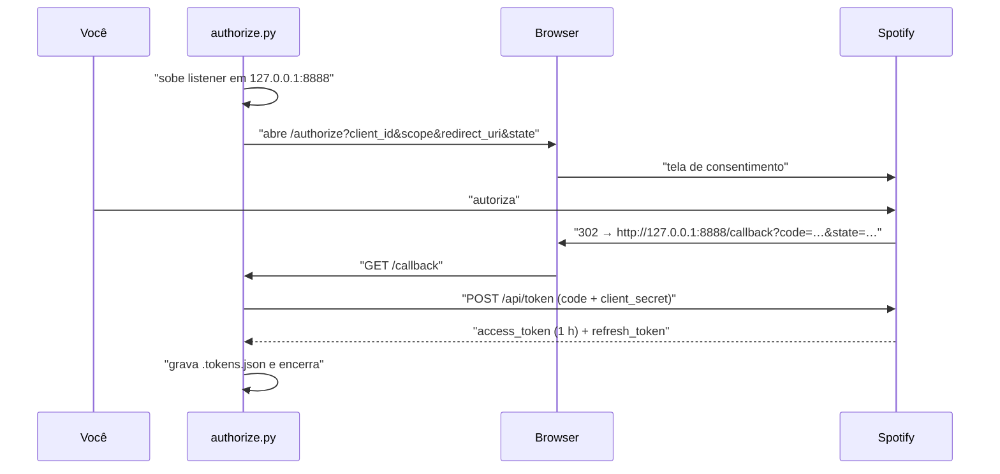

# 07 — Integração Spotify

Tudo nesta página foi conferido contra a documentação oficial. Onde há armadilha, ela está marcada 🔴
com o modo de falha concreto — não com aviso genérico.

O modelo é **Spotify Connect**: o app desktop é o motor de áudio e o `bq` é o controle remoto
([ADR-001](adr/ADR-001-spotify-connect-vs-web-playback-sdk.md)). Nenhum byte de áudio passa pelo nosso
processo.

## 1. Registro do app e escopos

No [dashboard do Spotify](https://developer.spotify.com/dashboard), criar um app. Development Mode
serve; **não é preciso pedir Extended Quota** — [ADR-001](adr/ADR-001-spotify-connect-vs-web-playback-sdk.md)
detalha por quê.

Dois escopos, e só:

| Escopo | Para quê |
|---|---|
| `user-read-playback-state` | `GET /me/player`, `GET /me/player/devices` |
| `user-modify-playback-state` | `PUT /me/player/play`, `/pause`, `PUT /me/player` |

**Não pedimos `streaming`.** Ele existe só para o Web Playback SDK, que não usamos — e pedir escopo
que não se usa é ruído na tela de consentimento. Também não pedimos nada de perfil, playlist ou
biblioteca: o `bq` não lê nada seu além do estado do player.

## 2. OAuth — Authorization Code

Fluxo de servidor com `client_secret`, porque o segredo vive nesta máquina e nunca vai para o browser.
Sem PKCE: PKCE existe para clientes públicos que não conseguem guardar segredo, o que não é o nosso
caso. Roda **uma vez**, no setup, via `scripts/authorize.py`.



### 🔴 `localhost` é **proibido** como redirect URI

Verificado na documentação oficial. As regras exatas:

- HTTPS é obrigatório, **exceto** para endereço de loopback, onde HTTP é permitido;
- **`localhost` não é aceito** — literalmente listado como não permitido;
- é preciso usar o **IP literal**: `http://127.0.0.1:8888/callback` ou `http://[::1]:8888/callback`.

Isso derruba o OAuth na primeira tentativa e **a maioria dos tutoriais na internet ensina errado**,
porque a regra endureceu depois de eles serem escritos. O erro que aparece é `INVALID_CLIENT: Invalid
redirect URI`, que não diz nada sobre `localhost` e manda você conferir o `client_id`.

O valor no `.env` tem de ser **byte a byte** igual ao registrado no dashboard, barra final incluída.

### Porta 8888, separada da porta 80 do app

O OAuth usa um listener próprio e efêmero em `127.0.0.1:8888`, não o servidor principal. Duas razões:
o `bq` roda em `:80` e um redirect sem porta (`http://127.0.0.1/callback`) depende de o Spotify
normalizar a porta default, o que não é garantido; e autorizar é setup, não runtime — misturar as duas
coisas coloca uma rota morta no app da festa.

### Renovação do token

`access_token` dura 1 hora — **menos que a festa**. O servidor renova sozinho quando faltarem menos de
5 minutos, e também sob `401` (uma retentativa). Nenhum browser é necessário para isso: só o
`refresh_token`.

🔴 **O Spotify pode devolver um `refresh_token` novo na renovação, e é preciso persistir esse novo.**
Se você ignorar e continuar usando o antigo, funciona por horas e falha depois — provavelmente às 23h,
com a casa cheia, e o sintoma é `400 invalid_grant` sem nenhuma relação aparente com o que você estava
fazendo. Regra: se a resposta de refresh trouxer `refresh_token`, sobrescreve o `.tokens.json`.

## 3. Resolução de device — por **nome**, nunca por id

```python
# bq/spotify/device.py
async def resolve() -> Device | None:
    devices = await client.get("/me/player/devices")          # user-read-playback-state
    return next((d for d in devices if d.name == settings.spotify_device_name), None)
```

🔴 **`device_id` não é persistente e cachear ele a noite toda é bug.** A documentação oficial diz, com
estas palavras: *"This ID is unique and persistent to some extent. However, this is not guaranteed and
any cached `device_id` should periodically be cleared out and refetched as necessary."*

O que acontece na prática: você fecha e reabre o Spotify (ou ele se reconecta sozinho), o id muda, e
todo `PUT /me/player/play?device_id=<antigo>` passa a devolver `404`. Se o `.env` guardar o **id**, a
recuperação exige editar arquivo e reiniciar o servidor no meio da festa. Guardando o **nome**, a
recuperação é uma chamada.

Política:

| Quando | Ação |
|---|---|
| no boot | resolve |
| a cada 5 min | re-resolve em background |
| em `404` de qualquer chamada de player | re-resolve e tenta **uma** vez |
| botão do `/host` ([05 §5](05-api-http.md)) | re-resolve na hora |

`SPOTIFY_DEVICE_NAME` default `PUMBABOOK` — o app desktop se registra com o nome do computador. Também
listado: *"Some device models are not supported and will not be listed in the API response"* — não nos
afeta (app desktop oficial), mas explica um device ausente se você testar com hardware de terceiros.

### Device ocioso

Um device Connect existe na lista enquanto o app está aberto e logado, mesmo sem tocar nada. Se o
`PUT /me/player/play?device_id=…` devolver `404 NO_ACTIVE_DEVICE`, a escalada é:

```
PUT /me/player  { "device_ids": ["<id>"], "play": false }     ← transfere/ativa
   e então repete o PUT /me/player/play
```

`device_ids` é array mas **aceita exatamente um elemento** — mais de um devolve `400`
(verificado na documentação).

Como o `bq` toca continuamente durante a festa, o device nunca fica ocioso depois da primeira faixa; a
escalada importa basicamente no **primeiro** despacho da noite.

## 4. Despacho

```http
PUT /v1/me/player/play?device_id=<id>
Content-Type: application/json

{ "uris": ["spotify:track:4iV5W9uYEdYUVa79Axb7Rh"] }
```

`204` = **aceito**. Requer Premium (verificado: *"This API only works for users who have Spotify
Premium"*).

**Usamos `uris`, nunca `context_uri`.** `context_uri` faria o Spotify tocar um álbum ou playlist e
seguir com a ordem *dele* — e a fila é nossa. Com `uris` de um único elemento, cada faixa é uma decisão
explícita do maestro.

🔴 **`204` não significa "tocando".** A confirmação vem do poller (§6), nunca do status HTTP — o
Spotify não garante ordem entre chamadas de player, e ancorar a projeção de posição no instante do
`204` faz o fim previsto sair errado e **cortar o final de todas as músicas**
([03 §4.5](03-arquitetura.md)).

### Por que não pré-enfileirar na fila nativa

Existe `POST /me/player/queue`, e usá-lo eliminaria os ~300 ms de silêncio entre faixas. Recusado: a
partir do momento em que uma faixa está na fila interna do Spotify, ela **sai do nosso controle** —
não dá para removê-la se o host der force-play, não dá para reordenar, e o comportamento de
`PUT play` sobre uma fila pendente não é documentado. Trocaríamos determinismo na fila (o produto)
por 300 ms de gap (dentro do [RNF-02](02-requisitos-nao-funcionais.md)). Registrado em
[ADR-001](adr/ADR-001-spotify-connect-vs-web-playback-sdk.md) para não ser reaberto por reflexo.

## 5. Rate limit

Verificado: **por app** (não por usuário nem por token), em **janela deslizante de 30 s**, com o valor
numérico **não divulgado**. `429` traz `Retry-After` em segundos.

Duas consequências que mudam o desenho:

1. **Não existe isolamento entre convidados.** Uma pessoa segurando uma tecla na busca gasta o
   orçamento de todos, e o sintoma é a busca morrer para a festa inteira, de uma vez.
2. **Busca e playback disputam o mesmo orçamento.** Se houver contenção, o que precisa sobreviver é o
   playback: busca falhando é uma pessoa esperando; playback falhando é silêncio na sala.

```python
# bq/spotify/client.py — política, não implementação
PRIORITY_PLAYBACK = 0     # play, pause, devices, me/player
PRIORITY_SEARCH   = 1     # /search
MAX_BACKOFF_SLEEP_MS = 5_000

# 1. Playback nunca espera atrás de busca na fila interna.
# 2. Um 429 no caminho de busca NÃO pausa o playback: escopos de backoff separados.
# 3. Retry-After é respeitado à risca; sem Retry-After, backoff 1s → 2s → 4s, teto 3 tentativas.
# 4. Erro de busca degrada para SEARCH_BUSY (05 §2) — nunca 500.
# 5. Respeitar o Retry-After NÃO é dormi-lo: acima de MAX_BACKOFF_SLEEP_MS a chamada é recusada
#    localmente, sem sair para a rede, até o prazo vencer.
# 6. O `reason` do corpo do 429 é lido e propagado — para o log, para o SpotifyError e para o /host.
```

### 🔴 O bloqueio de 01/08/2026, e as duas coisas que ele ensinou

Um app em **development mode** recebeu `Retry-After: 12922` — 3 h 35 min de bloqueio do `client_id`
inteiro, o mesmo prazo confirmado por duas medições independentes 19 min separadas. O que o produziu
não foi a festa: foi o poller a 1 Hz fixo, rodando 3 600 requisições/hora em sessões de
desenvolvimento com a fila vazia. A quota do development mode é bem menor que a de produção, e
extended quota mode não é saída realista para um projeto pessoal — o dashboard não expõe contador,
gráfico nem orçamento restante, então o **único** sinal observável é o próprio 429.

**Primeira lição — a cadência do poll é função do estado** ([03 §4.3](03-arquitetura.md),
`Conductor._poll_interval_ms`). O tick do laço continua local e a 1 Hz; o que varia é o
`GET /me/player`:

| Cadência | Quando | O que ela protege |
|---|---|---|
| `POLL_INTERVAL_MS` 1 s | despacho esperando confirmação, ou turno de karaokê | `DISPATCHING → PLAYING` só sai de `_confirm`, e `CONFIRM_TIMEOUT_MS` (4 s) conta com quatro chances; no karaokê é o poll que recala o Spotify que voltou sozinho, e o preço de atrasar é audível na sala |
| `POLL_WATCH_MS` 3 s | tocando ou pausado | só vigia interferência externa. Preço: detectar um sequestro em até 3 s em vez de 1 s |
| `POLL_IDLE_MS` 15 s | ocioso, festa pausada, modo passivo | nada. Não há play aberto para confirmar, proteger ou terminar — era aqui que estavam as 3 600 req/h sem consumidor |

Isso **não** mexe em RNF-02: o despacho é agendado por relógio local 150 ms antes do fim previsto
(§4.4 de 03), e [02 §1](02-requisitos-nao-funcionais.md) já dizia que *"o polling existe apenas como
rede de segurança"*. Nem mexe no detector de borda de `_notify_guard_edge`, que roda no tick local e
não custa requisição.

**Segunda lição — respeitar o `Retry-After` não é dormi-lo.** O código gravava o deadline e fazia
`continue`; a iteração seguinte dormia o prazo inteiro. Como `get_playback` é chamado de dentro do
`_lock` do maestro, era um `asyncio.sleep(12922)` com o lock na mão: por 3,5 h nada tocava, nada
pulava, nenhum karaokê começava, o botão "procurar o device" pendurava sem responder, e o log tinha
**uma linha**. O `authorize.py` fazia o mesmo e ficava mudo no terminal. Todos os indicadores verdes
com a sala em silêncio — [RNF-11](02-requisitos-nao-funcionais.md) na veia.

Acima do teto a chamada é recusada **antes de sair para a rede**: não queima orçamento contra um app
já bloqueado, e quem chamou finalmente vê o motivo — `DeviceResolver` grava em `last_error` e o
`/host` mostra na aba Saúde, `get_playback` devolve `ok=False`, a busca degrada em `SEARCH_BUSY`.

Orçamento em regime, revisado: ~240 req/h ociosas, ~1 200 req/h tocando, mais os despachos e os picos
de busca. O limitador continua existindo porque o teto real é desconhecido e o modo de falha é
público.

## 6. Leitura de estado

```http
GET /v1/me/player
```

### 🔴 `204` com corpo **vazio**

Quando não há playback ativo — que inclui o estado `idle` de [RF-17](01-requisitos-funcionais.md),
**esperado toda vez que a fila esvazia** — a resposta é `204 No Content` com corpo vazio. Chamar
`response.json()` nisso levanta exceção de parsing, não devolve `None`.

Como este é o poll periódico do maestro, uma exceção não tratada aqui não é um erro ocasional: é o
maestro morrendo a cada poll em que a fila estiver vazia — a cada segundo quando o poll era 1 Hz
fixo, a cada 15 s na cadência ociosa de §5, o que muda a frequência do sintoma e não o sintoma. E o `_step()` que morre para de despachar, então a fila
vazia se torna **permanente** — sugestões entram, nada toca, e todos os indicadores continuam verdes
([RNF-11](02-requisitos-nao-funcionais.md)).

```python
async def get_playback() -> Snapshot | None:
    r = await client.get("/me/player")
    if r.status_code == 204 or not r.content:
        return None                       # idle. Estado normal, não erro.
    ...
```

### Campos que podem vir nulos mesmo no `200`

`item` e `progress_ms` são documentados como nullable. E `currently_playing_type` pode ser
`track`, `episode`, `ad` ou `unknown`.

| Situação | Tratamento |
|---|---|
| `item is None` | trata como `idle`, não como erro |
| `currently_playing_type != 'track'` | mudança externa ([RF-19](01-requisitos-funcionais.md)) — não é nossa faixa |
| `progress_ms is None` | não re-ancora a projeção neste tick; mantém a anterior |
| `is_playing == False` com nossa faixa | `paused` — provavelmente pausa do host |

Não passamos `additional_types`: o default é só `track`, que é o que a fila produz. Um episódio
tocando é, por definição, mudança externa.

### Mapeamento para `_reconcile()`

| `GET /me/player` | Interpretação |
|---|---|
| `204` / `item is None` | nada tocando |
| `item.uri == current.uri` | nossa faixa — confirma ou corrige deriva |
| `item.uri != current.uri` | mudança externa → strike de [RF-19](01-requisitos-funcionais.md) |
| `is_playing == False` | pausado |

Tabela completa de transições em [03 §4.5](03-arquitetura.md).

## 7. Busca

```http
GET /v1/search?q=<texto>&type=track&limit=10
```

**`limit=10`.** A documentação registra o range de `limit` como `0–10` com default `5` — abaixo do que
muita referência antiga afirma. Dez é seguro sob qualquer leitura e é o número certo para tela de
celular de qualquer forma: vinte resultados exigem rolagem além da dobra, e a pessoa está de pé com uma
bebida na mão ([RF-04](01-requisitos-funcionais.md), [RNF-19](02-requisitos-nao-funcionais.md)).

**Não passamos `market`.** A documentação diz que, havendo token de usuário válido, *"the user's
account country takes priority"* — então o mercado da sua conta já se aplica e passar `market` é
redundante. O que **importa** é a outra metade da mesma frase: sem market **e** sem país de usuário, o
conteúdo é considerado indisponível. Como usamos token de usuário, estamos cobertos; se algum dia isso
virasse Client Credentials, a busca voltaria vazia e o motivo não seria óbvio.

### Cache · [RF-06](01-requisitos-funcionais.md)

```python
# chave: q normalizado (strip, lower, colapsa espaços). TTL 10 min. LRU de 200 entradas.
# Guarda SÓ os dados da faixa vindos do Spotify.
```

🔴 **`queueable` e `blockedReason` ([05 §3](05-api-http.md)) não podem ser cacheados.** Eles dependem
da fila e do histórico, que mudam a cada minuto. Cachear a resposta inteira faz a segunda pessoa que
buscar "Evidências" ver a faixa como disponível 8 minutos depois de ela já ter entrado na fila —
escolher, tocar no botão e levar `ALREADY_QUEUED`. O cache guarda o catálogo; a disponibilidade é
recalculada em cada resposta.

## 8. Catálogo de erros

| Status | Significado | Ação |
|---|---|---|
| `401` | token expirado ou inválido | renova e repete **uma** vez; se falhar de novo, `SPOTIFY_ERROR` |
| `403` | restrição — inclui `PREMIUM_REQUIRED` | não repete. Propaga com o `reason` do corpo |
| `404` | device desaparecido / `NO_ACTIVE_DEVICE` | re-resolve device (§3), repete uma vez |
| `429` | rate limit | respeita `Retry-After` (§5) |
| `502` `503` | transiente do Spotify | backoff 1s→2s→4s, 3 tentativas |
| `204` em `GET /me/player` | **não é erro** — é `idle` (§6) | segue o fluxo normal |

Toda chamada é embrulhada: nenhuma exceção de Spotify sobe até derrubar o maestro ou fechar
WebSockets ([RNF-10](02-requisitos-nao-funcionais.md)).

## 9. Checklist de setup

1. Criar o app no dashboard; anotar `client_id` e `client_secret`.
2. Registrar `http://127.0.0.1:8888/callback` como Redirect URI — **IP literal, não `localhost`** (§2).
3. Preencher `api/.env` ([03 §7](03-arquitetura.md)).
4. Abrir o **app desktop do Spotify** e logar na conta Premium.
5. `python scripts\authorize.py` → autoriza no browser → `.tokens.json` gravado.
6. Conferir que o device aparece: `GET /me/player/devices` deve listar `PUMBABOOK`.
7. Tocar **qualquer coisa** manualmente uma vez no app desktop. Não é obrigatório, mas garante que o
   device esteja ativo antes do primeiro despacho e evita a escalada de §3 na estreia.
