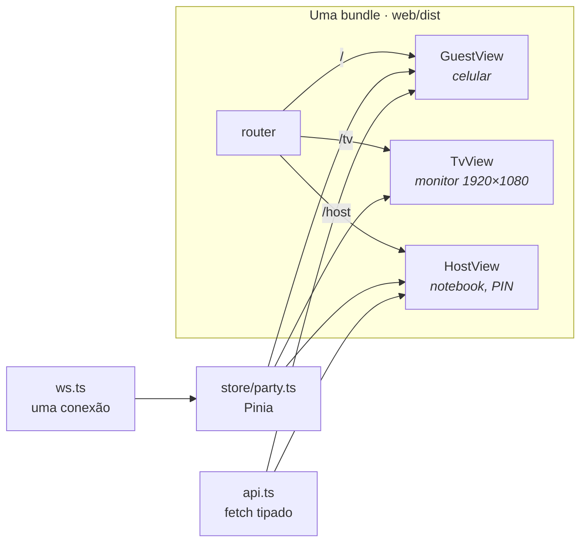
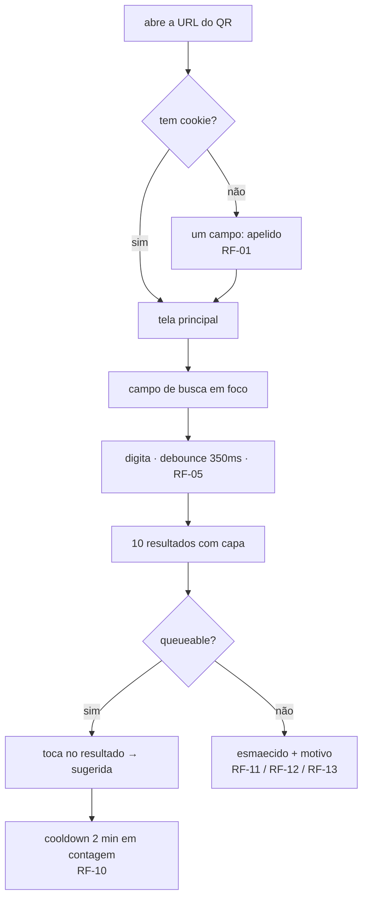

# 08 — Frontend

Uma SPA em Vue 3 + TypeScript, três rotas, servida como estático pelo próprio FastAPI
([03 §2](03-arquitetura.md)). Mesma origem, sem CORS, sem segundo processo em produção.

## 1. Rotas



Uma store, alimentada por uma conexão, lida por três telas. As telas **não fazem fetch de estado** —
só de ações. Isso é o que garante que `/tv` e `/` nunca mostrem coisas diferentes: elas literalmente
leem o mesmo objeto.

`createWebHistory` — o servidor devolve `index.html` para qualquer rota não-`/api`
([05 §6](05-api-http.md)).

## 2. Tipos — três origens, uma regra cada

| Origem | O quê | Regra |
|---|---|---|
| `types/api.d.ts` | contratos HTTP | **gerado** do OpenAPI. Não editar, não versionar decisão nele |
| `types/ws.ts` | mensagens do WebSocket | **à mão**, união discriminada ([06 §3](06-realtime-websocket.md)) |
| `types/brands.ts` | `TrackId`, `PlayId`, … | à mão, 8 linhas |

```jsonc
// package.json
"scripts": {
  "types": "openapi-typescript http://127.0.0.1/openapi.json -o src/types/api.d.ts",
  "build": "npm run types && vue-tsc --noEmit && vite build"
}
```

O `vue-tsc --noEmit` **antes** do `vite build` é deliberado: o Vite transpila TS sem checar tipos, então
sem esse passo o build passa com erro de tipo e você descobre em runtime. Como o `types` roda antes,
uma mudança de campo no pydantic quebra o build — que é exatamente o efeito desejado
([ADR-006](adr/ADR-006-contratos-openapi-typescript.md)).

### Branded types

Existem quatro identificadores textuais/numéricos no sistema e trocar um pelo outro compila
silenciosamente ([README, glossário](README.md#os-quatro-tipos-de-string-que-não-podem-se-misturar)):

```ts
// types/brands.ts
declare const brand: unique symbol
type Brand<T, B> = T & { readonly [brand]: B }

export type TrackId  = Brand<string, 'TrackId'>
export type TrackUri = Brand<string, 'TrackUri'>
export type PlayId   = Brand<number, 'PlayId'>
export type GuestId  = Brand<number, 'GuestId'>
```

O par que realmente importa é **`TrackId` × `TrackUri`**: `4iV5W9uYEdYUVa79Axb7Rh` e
`spotify:track:4iV5W9uYEdYUVa79Axb7Rh` são os dois `string`, e mandar o `TrackId` onde o Spotify quer
`TrackUri` é aceito pelo compilador, aceito pelo `fetch`, e **falha no servidor**. O único `as` do
código-fonte inteiro está aqui, na fronteira onde o dado entra — depois disso o compilador cuida
([RNF-22](02-requisitos-nao-funcionais.md)).

### O que o `strict` compra especificamente aqui

`noUncheckedIndexedAccess` faz `queue[0]` ter tipo `QueueItem | undefined`. É chato, e é chato no lugar
certo: a fila **está vazia de propósito** às 22h30 por [ADR-005](adr/ADR-005-fila-vazia-silencio.md), e
`queue[0].track.name` seria uma exceção em runtime no estado mais visível da festa, no monitor grande.

## 3. A store

```ts
// stores/party.ts
export const useParty = defineStore('party', () => {
  const player  = ref<PlayerState>({ type: 'idle' })
  const queue   = ref<QueueItem[]>([])
  const skip    = ref<SkipState>({ votes: 0, needed: 5, youVoted: false,
                                   blockedReason: null, blockedUntilMs: null })
  const me      = ref<Me | null>(null)
  const settings = ref<Settings | null>(null)
  const guestsOnline = ref(0)
  const v = ref(0)
  const connected = ref(false)

  function apply(msg: Extract<ServerMsg, { type: 'state' }>) {
    v.value = msg.v
    player.value = msg.player          // substituição, nunca merge — §3.1
    queue.value = msg.queue
    skip.value = msg.skip
    me.value = msg.me
    settings.value = msg.settings
    guestsOnline.value = msg.guestsOnline
  }
  return { player, queue, skip, me, settings, guestsOnline, v, connected, apply }
})
```

### 3.1 `apply` substitui, nunca faz merge

O snapshot é completo ([06 §2](06-realtime-websocket.md)), então substituir é correto **e** é o que
mantém a união discriminada válida. Fazer `Object.assign(player.value, msg.player)` produziria um objeto
com `type: 'idle'` e um `track` sobrando da faixa anterior — um estado que o tipo declara impossível e
que o runtime aceita. A tela então renderiza a capa de uma música que não está tocando, e o bug parece
"cache de imagem".

## 4. `GuestView` — o caminho de 30 segundos

[S2](00-visao-e-escopo.md#5-critérios-de-sucesso) é "do QR ao 'sugerida' em menos de 30 s". A tela é
desenhada em volta disso.



Quatro decisões de tela que vêm direto dos requisitos:

- **O campo de busca já vem em foco.** Um toque a menos no caminho crítico.
- **O resultado indisponível aparece esmaecido com o motivo, não escondido nem clicável.** O
  `queueable` vem calculado do servidor ([05 §3](05-api-http.md)) justamente para isso. Esconder faria
  a pessoa buscar de novo achando que errou o nome; deixar clicável faria ela escolher, tocar e levar
  erro.
- **O cooldown é contagem regressiva, não texto estático.** "Espere 2 minutos" às 20h04 é mentira às
  20h05.
- **O botão de pular mostra o motivo antes de ser tocado.** `skip.blockedReason` desabilita o botão com
  a explicação ([06 §3](06-realtime-websocket.md)) — em vez de a pessoa tocar e receber um `409`.

### A aba de karaokê, e o INICIAR

O alternador `Ouvir | 🎤 Cantar` **só existe** quando `settings.karaokeEnabled` — que compõe duas
coisas no servidor: o host ligou **e** há chave do YouTube. Nem existe e responde 422 no toque:
não existe.

**Duas abas e não uma lista misturada**, e o motivo é de acervo: "evidências" no Spotify devolve a
gravação do Chitãozinho; no YouTube de karaokê devolve o playback com a letra. Numa lista só, quem
quer cantar toca no item errado e só descobre com o próprio nome já no telão.

O **INICIAR** fica num painel próprio **acima de tudo**, e não dentro de "Minhas". É a ação mais
urgente que este app tem: a sala está em silêncio, o nome da pessoa está num monitor de 40
polegadas, e ela tem 45 segundos. Abaixo da dobra, ela rola procurando enquanto a vez escorre.

🔴 **Ele aparece por `guestId`, nunca por apelido.** Dois "Ana" numa festa de trinta é comum — e
com a comparação errada o botão aparece para as duas, e a que tocar primeiro rouba a vez da outra.
Sem erro nenhum na tela.

Durante um turno o card "Tocando agora" tem um **ramo próprio**: não existe `Track` nenhuma, e sem
ele a tela diria "Nada tocando. Sugira uma música e ela começa na hora" com alguém cantando na
sala. Quem não é o dono da vez também vê ("Chamando no microfone · Fulano"), e é assim que entende
o silêncio.

### Retirar o voto

O botão é toggle na aparência e **dois endpoints** por baixo
([05 §3](05-api-http.md)). Quando `youVoted` é `true`, ele chama `DELETE` e **está sempre habilitado**,
mesmo em proteção, mesmo em cooldown — [RF-22](01-requisitos-funcionais.md) não tem exceção. Deixar o
`blockedReason` desabilitar o botão nesse estado prenderia a pessoa no voto pela interface, mesmo com o
backend permitindo a retirada.

## 5. `TvView`

```
┌──────────────────────────────────────────────────────────────────────┐
│  ┌────────────┐   TOCANDO AGORA                                     │
│  │            │   Evidências                              72 px     │
│  │   CAPA     │   Chitãozinho & Xororó                    40 px     │
│  │  480×480   │   sugerida por Ana                        28 px     │
│  │            │   ▓▓▓▓▓▓▓▓▓▓▓░░░░░░░░░░░  2:14 / 4:49              │
│  └────────────┘   ┌──────────────┐                                  │
│                   │  PULAR 3/5   │  ← ou "PROTEGIDA 47s" (RF-34)    │
│                   └──────────────┘                                  │
├──────────────────────────────────────────────────────────────────────┤
│  A SEGUIR                                        ┌────────┐         │
│   ▸ Sabotage — Beastie Boys · Bru                │  ███   │         │
│     Bete Balanço — Barão Vermelho · Caio         │  █ █   │  QR     │
│     Deja Vu — Iron Maiden · Ana  ↩               │  ███   │         │
│     …                                            └────────┘         │
│                                              192.168.0.10           │
│                                              27 pessoas · RF-35      │
└──────────────────────────────────────────────────────────────────────┘
```

- **Sem numeração na fila** — [RF-33](01-requisitos-funcionais.md). O `▸` marca só o próximo. O `↩`
  marca `wasInterrupted` ([06 §3](06-realtime-websocket.md)).
- **`▸ A SEGUIR` tem de sair da store, não de `queue[0]` recalculado à mão.** A sugestão que voltou por
  force-play tem `rank = -1` e é a próxima; se a tela ordenar por conta própria, ela anuncia uma faixa e
  a sala ouve outra.
- **Contador vira contagem de proteção quando protegida**, nunca escudo mudo — o porquê está em
  [RF-26](01-requisitos-funcionais.md).
- **Nada clicável** ([RF-38](01-requisitos-funcionais.md)): sem `<button>`, sem `<input>`, sem `<a>`.
- Estado `idle` → componente separado em tela cheia ([RF-36](01-requisitos-funcionais.md)), QR gigante.
  É um ramo obrigatório da união, não um `v-if` no fim do arquivo.

Fullscreen no Chrome: `.\start.ps1 -Tv`. Sem cursor, sem barra, sem risco de alguém navegar — e com
os dois flags que o karaokê exige. Detalhe no [runbook §1.1](11-runbook-da-festa.md).

### 5.1 `TvKaraoke` — os três ecrãs, UM componente, UM player

```
┌──────────────────────────────────────────────────────────────────────┐
│  ┌────────────────────────────────────┐  KARAOKÊ                     │
│  │                                    │  Ana                   36 px │
│  │       é a vez de                   │  Evidências — Karaokê…       │
│  │           ANA               96 px  │  Karaokê Brasil              │
│  │   toque INICIAR no celular         │  ─────────────────────       │
│  │            0:38             84 px  │  A SEGUIR                    │
│  │                                    │   🎤 Garota de Ipanema       │
│  └────────────────────────────────────┘   Bia                        │
│   ↑ a chamada é uma CAMADA sobre o vídeo  ┌────┐ ┌────┐              │
│     — o iframe já está montado e          │ QR │ │ QR │  RF-35       │
│     bufferizando por baixo dela           └────┘ └────┘              │
└──────────────────────────────────────────────────────────────────────┘
```

🔴 **O componente não é remontado entre as fases, e é a decisão que faz a feature funcionar.** O
iframe nasce na chamada e bufferiza enquanto a sala olha para o nome da pessoa; quando ela toca em
INICIAR, o vídeo **começa** em vez de começar a carregar. Chavear as fases por `v-if` dentro de um
`<Transition>` destruiria o player a cada troca e devolveria 2–4 s de tela preta com trinta pessoas
em silêncio. Por isso a `<Transition>` da `TvView` envolve o componente **inteiro**, com chave fixa
`"karaoke"` — e nunca o `playId`, que é `null` na chamada e no fecho.

- **Layout pillarbox**, coluna de `w-80` à direita. **Nada nosso encosta no terço inferior do
  vídeo**, que é onde a letra fica — uma faixa por baixo teria custado a legenda.
- **`pointer-events: none` no wrapper do iframe**, e ele herda para dentro do frame. É a medida que
  torna [RF-38](01-requisitos-funcionais.md) *verdadeiro* e não *provável*: um iframe é um
  documento com superfície clicável própria, e `controls=0` não a elimina — um clique no meio do
  vídeo pausa. As outras duas (`disablekb`, a `/tv` não ter mouse) não bastam sozinhas.
- **`iv_load_policy: 3`** é o parâmetro que mais protege a feature: anotações e cards do YouTube
  aparecem **sobre a letra**.
- **Autoplay barrado tem tela própria e a saída é uma TECLA**, não um botão: a regra é sobre o que
  a tela exibe e sobre o que um convidado alcança pelo celular, e um listener de `keydown` só é
  acionável pelo teclado do notebook que roda o quiosque. Detecção em duas vias
  (`onAutoplayBlocked`, que não existe em todo navegador, e um vigia de 1,5 s).
- **Só a `/tv` dona monta o player.** Uma segunda tela mostra tudo e fica muda
  ([RF-51](01-requisitos-funcionais.md)); a posse é arbitrada pelo servidor
  ([05 §3.1](05-api-http.md)).
- 🔴 **A posse chega DEPOIS do `onMounted`** — o claim é um POST. O componente observa a prop com
  `flush: 'post'`; sem isso, um F5 no meio de uma música deixa a tela preta até o teto vencer, que
  é exatamente o caso que o F5 deveria socorrer.

## 6. Barra de progresso

Projeção local com re-ancoragem, especificada em [06 §5](06-realtime-websocket.md). No `/tv` ela roda a
250 ms; no celular, a 1 s (a barra é pequena e a bateria é do convidado).

## 7. Mobile — os detalhes que quebram

| Item | Regra | Se ignorar |
|---|---|---|
| `font-size` dos inputs | **≥ 16 px** ([RNF-20](02-requisitos-nao-funcionais.md)) | o iOS dá zoom ao focar a busca, o layout sai de lugar, e isso acontece na **primeira** interação da pessoa com o app |
| `viewport` | `width=device-width, initial-scale=1, viewport-fit=cover` | notch cobrindo conteúdo |
| altura | `100dvh`, não `100vh` | a barra do Safari come 60 px e o botão de sugerir fica embaixo dela |
| `visibilitychange` | revalida por `/api/state` ([06 §7](06-realtime-websocket.md)) | socket zumbi mostrando a fila de 20 min atrás |
| toque | alvo ≥ 44 px | erro de toque com o celular na mão, de pé |
| `user-select` | desligado nos resultados | seleção acidental em vez de toque |

Os dois primeiros são de 30 segundos cada e são a diferença entre parecer um app e parecer um site
quebrado.

## 8. `HostView`

**Três abas**, e você vai usar isso de pé, no escuro, com uma mão, no meio de uma conversa.

| Aba | Conteúdo |
|---|---|
| **Fila** | tocando + **nomes de quem votou** ([RF-25](01-requisitos-funcionais.md)) · `Pular` · `Pausar` · `Tocar agora` (busca + 1 toque) · a fila com `↑` tocar em seguida, `↓` tocar por último, `✕` remover, e esvaziar |
| **Regras** | 8 limiares com efeito imediato ([RF-24](01-requisitos-funcionais.md)), agrupados em Pular / Sugerir / Tocar agora, cada um com `(?)` explicativo, mais a **janela de voto** |
| **Saúde** | 4 KPIs (device, maestro, poll, invariantes), detalhe com token do Spotify, e o diagnóstico de devices ([05 §5](05-api-http.md)) |

Fora das abas ficam duas coisas, e cada uma por um motivo: o cabeçalho, e o **banner de rendição de
[RF-19](01-requisitos-funcionais.md)** — quando o maestro está passivo nada mais nesta tela funciona
como o esperado, e a explicação tem de estar acima do sintoma, inclusive acima da escolha de aba.

**A barra de abas carrega estado, e é isso que a justifica.** Abas escondem informação, e a
informação que o `/host` esconde é justamente a que te fez abrir o `/host`. A barra mostra a contagem
da fila e um `●` que acende quando algo está mal na Saúde (`warn` degradou, `hot` a festa parou) **ou
quando há erro pendente numa aba que não é a atual**. Sem o segundo, um `PATCH` recusado em Regras é
invisível para quem está na Fila.

### 8.1 Onde mora o estado, e por quê

`HostView.vue` é dono de **todo** o estado e de **todo** o ciclo de vida; os componentes em
`src/components/` são apresentação pura. Não é preguiça — é o que esta tabela obriga:

| Recurso (poll de 3 s) | Buscado para | Também lido por |
|---|---|---|
| `saude.conductor.passive` | Saúde | **fora das abas** — o banner de RF-19 |
| `cfg.paused` | Regras | **Fila** — a troca `Pausar`/`Retomar` |
| `votantes` | Saúde | **Fila** — os nomes de RF-25 |

Todo recurso é lido por mais de um lugar, então componentes por aba viveriam de ~14 props e emits, e
um emit esquecido falha em silêncio. A regra que sai disso:

> **Estado de WebSocket vem da store, lido onde é renderizado. Estado de HTTP (`cfg`, `saude`,
> `votantes`) é do host, pertence ao `HostView`, e desce como prop.**

Três armadilhas de ciclo de vida, todas já custaram tempo em alguma tela:

- **`useNow(500)` fica no `HostView`, nunca num filho.** `useClock.ts` cria o `setInterval` **na
  chamada** e só o limpa em `onUnmounted`: num componente alternado por aba isso rotaciona intervalos
  a cada clique. E as três taxas são deliberadas — um segundo relógio num filho as dobraria.
- **Os corpos usam `v-show`, não `v-if`.** Com `v-if`, trocar de aba destrói `q`/`results`: você
  digita, olha as Regras, volta, e a busca sumiu.
- **A aba vai na URL (`?aba=`) com `router.replace`, nunca `push`.** Com `push`, cada clique é uma
  entrada de histórico e o voltar passeia pelas abas em vez de sair da página. E **não** acrescente
  `:key` ao `<RouterView />` do `App.vue`: sem key, navegação só-de-query reusa a instância; com
  key, cada clique de aba refaz o `GET /api/host/settings` e reinicia o intervalo.

### 8.2 A janela de voto

No pé do grupo "Pular": *"Nesta música, dá para votar de 0:20 até 3:05"*, calculada sobre a faixa que
está tocando, em `text-hot` quando os limiares se fecham.

🔴 **Não é enfeite: é a condição de validade da remoção do teto de 25 %**
([ADR-004 §Revisão](adr/ADR-004-skip-5-votos-sem-ttl.md)). Sem o teto,
`minHeardMs + minRemainingMs > duração` torna a faixa impossível de pular e o servidor aceita o
ajuste respondendo 200 — não há erro em lugar nenhum. Esta linha é a única coisa que avisa. **Se ela
sair da tela, o teto tem de voltar.**

### 8.3 Select e não slider

Os limiares eram `<input type="range">`. Saíram porque o host escolhe uma **política** ("dois minutos
entre sugestões"), não calibra um valor contínuo — e porque o slider tinha um defeito estrutural:
`:value` preso à verdade do servidor com `@change` faz o número **não se mover enquanto você
arrasta**; ele salta depois da resposta. No celular, o `<select>` abre o seletor do sistema, não dá
para arrastar até um valor absurdo, e a lista de opções **é** a recomendação.

A tabela de opções vive em `src/regras.ts` (dado puro, sem Vue) e fecha com um assert de cobertura:
acrescentar um limiar no backend faz `npm run build` falhar até ele ganhar controle na tela. Foi o
que faltou para `minHeardMs` e `minRemainingMs`, aceitos pelo `PATCH` desde M1 sem nenhuma UI.

**"Tocar agora" é o botão mais importante da tela** e precisa ser alcançável em um toque a partir da
busca. É a saída manual do estado `idle` de [ADR-005](adr/ADR-005-fila-vazia-silencio.md) — a rede que
transforma "silêncio quando a fila esvazia" numa espera em vez de um beco. Se ele exigir três toques,
a decisão de fila vazia fica pior do que foi projetada.

O PIN ([RF-31](01-requisitos-funcionais.md)) é uma tela de 4 dígitos, uma vez, cookie de 24 h.

## 9. Dependências do frontend

| Pacote | Por quê |
|---|---|
| `vue` `vue-router` `pinia` | base |
| `tailwindcss` `@tailwindcss/vite` | v4, uma linha de config |
| `qrcode` | [RF-35](01-requisitos-funcionais.md), gerado no cliente |
| `openapi-typescript` (dev) | [ADR-006](adr/ADR-006-contratos-openapi-typescript.md) |
| `vue-tsc` `typescript` (dev) | checagem no build |

Sem biblioteca de componentes, sem gerenciador de HTTP, sem cliente de WebSocket. `fetch` e
`WebSocket` nativos: o `api.ts` tem ~40 linhas e o `ws.ts` ~50, e ambos são inteiramente nossos —
numa app de 3 telas, uma dependência de UI custaria mais tempo de configuração do que economiza de CSS.

🔴 **Esta seção é sobre dependências de terceiros, não sobre componentes próprios**, e a distinção já
foi lida errado uma vez. O custo citado acima é *tempo de configuração*, e para um `.vue` neste
projeto ele é zero: `src/components/` já está na árvore normativa de
[03 §3](03-arquitetura.md), o `tsconfig.json` já cobre `src/**/*.vue` e o alias `@` já resolve. A
[§8](#8-hostview) deste mesmo documento **manda** usar componente para o estado `idle` do `/tv`.

A regra para componentes próprios é **repetição, não tamanho**: extrai em N ≥ 3 instâncias, deixa
inline em N = 1. Os três de hoje — `Abas`, `CampoSelect`, `Kpi` — existem porque cada um substituiu de
3 a 8 blocos de marcação quase idêntica, que é o código de maior densidade de defeito de uma tela. Um
componente por *seção* seria o erro oposto: ver [8.1](#81-onde-mora-o-estado-e-por-quê).

## 10. Desenvolvimento vs produção

| | Dev | Produção |
|---|---|---|
| Frontend | `vite dev` em `:5173`, HMR | `web/dist` servido pelo FastAPI em `:80` |
| API | uvicorn `:80` | o mesmo |
| Proxy | `server.proxy` do Vite manda `/api` e `/ws` para `:80` | não existe |
| CORS | não é preciso — o proxy resolve | mesma origem |

O proxy do Vite existe para o dev não precisar de CORS nem de URL absoluta no código. Em produção a
origem é a mesma, então `fetch('/api/...')` e `new WebSocket('/ws')` funcionam nos dois modos sem
condicional.
