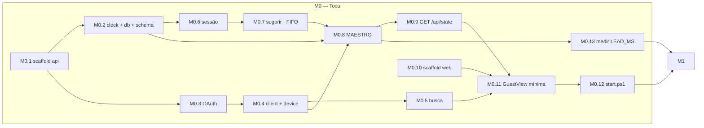

# 09 — Plano de implementação

Sem data marcada para a festa, então o plano é em **horas de esforço**, não em calendário.

A regra que organiza tudo: **M0 é autossuficiente.** Se a data aparecer para depois de amanhã, M0
sozinho já dá uma festa que funciona — música toca, gente sugere do celular, a fila anda. M1 é o que
transforma isso num jogo. M2 é acabamento e resiliência.

| Milestone | Esforço | Entrega |
|---|---|---|
| **M0 — Toca** | **≈ 9,5 h** | Uma música sugerida do celular toca na JBL, e a próxima entra sozinha |
| **M1 — O jogo** | **≈ 17,5 h** | Fila justa, votação, `/tv`, `/host` completo |
| **M2 — Acabamento** | **≈ 6,5 h** (+3 h opcional) | Resiliência, histórico, animações |
| | **≈ 33,5 h** | |

> **Nota de honestidade sobre a estimativa.** O brief anterior falava de ~21,5 h. A diferença não é
> inflação: aquele número não incluía o frontend, que agora está especificado
> ([08](08-frontend.md)) e custa ~10 h das 33,5. As telas são metade deste projeto.

## Ordem de dependência

O caminho crítico passa por **M0.8, o maestro**. Tudo antes dele é preparação; nada depois dele
funciona sem ele. Se o tempo apertar, é a tarefa em que vale gastar o dobro do estimado.

---

## M0 — Toca · ≈ 9,5 h

**Definição de pronto do milestone:** você abre a URL no celular pela rede Wi-Fi, digita um apelido,
busca uma música, toca nela, e o som sai na JBL em segundos. Quando ela acaba, a próxima da fila entra
sozinha. Você não tocou no notebook durante nada disso.

| # | Tarefa | h | RF/RNF | Pronto quando |
|---|---|---|---|---|
| **M0.1** | Scaffold `api/`: venv, `pyproject.toml`, `config.py` com pydantic-settings, FastAPI subindo | 0,5 | [RNF-25](02-requisitos-nao-funcionais.md) | `GET /health` responde e `.env` inválido **aborta o boot** com mensagem legível |
| **M0.2** | `clock.py`, `db.py` com PRAGMAs, `schema.sql`, seeds, bootstrap | 0,75 | [RF-39](01-requisitos-funcionais.md) | `party.db` criado; as 7 queries de [INV](04-modelo-de-dados.md#5-invariantes) rodam e devolvem 0 |
| **M0.3** | `scripts/authorize.py` + `spotify/auth.py` com refresh e persistência do refresh token novo | 1,0 | [07 §2](07-integracao-spotify.md) | `.tokens.json` gravado; forçar expiração e ver a renovação sozinha |
| **M0.4** | `spotify/client.py` (httpx, 401→refresh→retry, catálogo de erros) + `device.py` resolvendo **por nome** | 1,0 | [07 §3](07-integracao-spotify.md) | `resolve()` acha `PUMBABOOK`; fechar e reabrir o Spotify e re-resolver funciona |
| **M0.5** | `search.py` + `GET /api/search` (sem cache ainda), `limit=10` | 0,5 | [RF-04](01-requisitos-funcionais.md) | busca "Evidências" devolve 10 faixas com capa e duração |
| **M0.6** | `POST /api/session` + cookie **sem `Secure`** | 0,25 | [RF-01](01-requisitos-funcionais.md) [RF-02](01-requisitos-funcionais.md) | fecha o browser, reabre, continua reconhecido |
| **M0.7** | `POST /api/suggestions` — FIFO puro, **sem** cooldown/dedupe/duração | 0,5 | [RF-07](01-requisitos-funcionais.md) | sugestão aparece na tabela em `queued` |
| **M0.8** | **O maestro**: laço com prazo único, `_step`, `_dispatch`, `_reconcile`, `_end_play` | 2,0 | [RF-15](01-requisitos-funcionais.md) [RF-16](01-requisitos-funcionais.md) [RNF-02](02-requisitos-nao-funcionais.md) | 3 faixas em sequência sem tocar em nada; `GET /me/player` devolvendo 204 **não** derruba a task |
| **M0.9** | `GET /api/state` | 0,25 | [05 §3](05-api-http.md) | devolve o mesmo shape que o WS vai enviar |
| **M0.10** | Scaffold `web/`: Vite, Vue, TS strict, Tailwind v4, router, proxy de dev | 0,75 | [RNF-22](02-requisitos-nao-funcionais.md) | `npm run build` limpo com `vue-tsc` |
| **M0.11** | `GuestView` mínima: apelido, busca, sugerir, fila (polling de 2 s, sem WS) | 1,25 | [RF-01](01-requisitos-funcionais.md) [RF-04](01-requisitos-funcionais.md) [RF-07](01-requisitos-funcionais.md) | funciona **no celular de verdade**, pela LAN, não no desktop |
| **M0.12** | `start.ps1`: build se preciso, uvicorn `:80`, imprime IP e URL em destaque | 0,5 | [RNF-25](02-requisitos-nao-funcionais.md) | um comando, e a URL do QR está na tela |
| **M0.13** | **Medir `DISPATCH_LEAD_MS`** com a JBL ligada | 0,5 | [RNF-02](02-requisitos-nao-funcionais.md) | gap medido ≤ 1 s em 5 transições; constante ajustada |

**M0.13 é curta e não é opcional.** `DISPATCH_LEAD_MS = 150` é palpite fundamentado
([03 §4.4](03-arquitetura.md)); alto demais corta o final das músicas, baixo demais devolve o silêncio.
Duas mecânicas puxando a mesma constante, e a única forma de acertar é com cronômetro e a caixa ligada.
Meia hora aqui vale mais que qualquer refinamento de código.

**Fora de M0, deliberadamente:** justiça na fila, cooldown, votação, `/tv`, `/host`, WebSocket. M0
usa FIFO e polling porque o objetivo é provar o caminho do áudio ponta a ponta — é onde estão as
incógnitas externas ([00 §3](00-visao-e-escopo.md)).

---

## M1 — O jogo · ≈ 17,5 h

**Definição de pronto:** cinco celulares pulam uma música. A fila alterna visivelmente entre pessoas.
O monitor mostra tudo e explica as regras sozinho. Você controla tudo pelo `/host` sem tocar em código.

| # | Tarefa | h | RF/RNF | Pronto quando |
|---|---|---|---|---|
| **M1.1** | `ws.py`: manager, `build_snapshot`, `personalize`, broadcast; uvicorn com ping de protocolo | 1,5 | [RNF-13](02-requisitos-nao-funcionais.md) | 3 abas recebem estado ao mesmo tempo; matar a rede e voltar reconecta sozinho |
| **M1.2** | `ws.ts` + store Pinia + `types/ws.ts` (união discriminada) | 1,25 | [RNF-23](02-requisitos-nao-funcionais.md) | `apply` **substitui**, e o TS recusa `player.track` sem estreitar |
| **M1.3** | `openapi-typescript` no build + `types/brands.ts` | 0,5 | [RNF-22](02-requisitos-nao-funcionais.md) | renomear um campo no pydantic **quebra** `npm run build` |
| **M1.4** | `queue.py`: round-rank, cooldown, dedupe, duração máx., janela de repetição | 1,5 | [RF-08](01-requisitos-funcionais.md)…[RF-13](01-requisitos-funcionais.md) | os 5 cenários de [04 §4.3](04-modelo-de-dados.md) passam como teste |
| **M1.5** | `DELETE /api/suggestions/{id}` | 0,25 | [RF-14](01-requisitos-funcionais.md) | só a própria; **não** devolve cota |
| **M1.6** | `votes.py`: guardas na ordem, `evaluate()`, `conductor.skip()` com cooldown **antes** do HTTP | 1,5 | [RF-20](01-requisitos-funcionais.md)…[RF-23](01-requisitos-funcionais.md) | 7 votos simultâneos pulam **uma** faixa, não duas ([05 §4.1](05-api-http.md)) |
| **M1.7** | `POST` e `DELETE /api/skip-votes` — **handlers separados** | 0,5 | [RF-20](01-requisitos-funcionais.md) [RF-22](01-requisitos-funcionais.md) | retirar voto funciona **durante proteção e durante cooldown** |
| **M1.8** | `queueable`/`blockedReason` na busca + cache LRU do catálogo | 0,75 | [RF-06](01-requisitos-funcionais.md) [RF-11](01-requisitos-funcionais.md) | faixa na fila aparece esmaecida com o nome de quem sugeriu; cache **não** congela isso |
| **M1.9** | `PATCH /api/session` — renomeia, não recria | 0,25 | [RF-03](01-requisitos-funcionais.md) | trocar apelido **não** zera o cooldown |
| **M1.10** | `GuestView` completa: contagem de cooldown, botão de voto com motivo, "minhas sugestões" | 2,0 | [RF-10](01-requisitos-funcionais.md) [RF-20](01-requisitos-funcionais.md) [RF-22](01-requisitos-funcionais.md) | o botão explica-se **antes** de ser tocado |
| **M1.11** | `TvView`: layout, projeção de posição, QR, fila sem números, contador, tela de fila vazia | 2,5 | [RF-32](01-requisitos-funcionais.md)…[RF-38](01-requisitos-funcionais.md) | legível a 3 m; barra **não** anda em degraus nem para trás |
| **M1.12** | `HostView` + PIN + skip + pause + remover + sliders + votantes + saúde | 2,5 | [RF-24](01-requisitos-funcionais.md)…[RF-31](01-requisitos-funcionais.md) | mover o slider de 5→3 muda o `/tv` na mesma hora |
| **M1.13** | Force-play no maestro: `rank=-1`, proteção de 90 s, contagem no `/tv` | 1,0 | [RF-26](01-requisitos-funcionais.md) | a interrompida volta e é a **próxima**; falha no `PUT` não quebra a fila |
| **M1.14** | Fila vazia → silêncio + estado `idle` | 0,25 | [RF-17](01-requisitos-funcionais.md) | esvaziar a fila para o som e enche a tela do `/tv` |
| **M1.15** | **Spotify falso** (`httpx.MockTransport`) + testes de mesa | 1,5 | [10](10-testes-e-validacao.md) | uma festa de 20 faixas roda em < 5 s, sem rede |

**M1.15 é a tarefa de maior alavancagem do projeto.** Sem ela, testar uma transição de faixa custa
3 minutos de espera e uma caixa de som ligada; testar "7 votos chegando em 80 ms" é impossível. Com
ela, o maestro roda com relógio injetado e a noite inteira acontece em segundos — e os dois bugs de
ordenação que o [05 §4.1](05-api-http.md) descreve ficam **cobertos por teste** em vez de cobertos por
atenção. Está no fim da lista por dependência, não por prioridade; se M1 for cortado, ela não é a
primeira a sair.

---

## M2 — Acabamento · ≈ 6,5 h (+3 h opcional)

Nada aqui é necessário para a festa funcionar. Está em ordem de valor por hora.

| # | Tarefa | h | RF/RNF |
|---|---|---|---|
| **M2.1** | Supervisor do maestro com backoff + exposição no `/host` | 0,5 | [RNF-11](02-requisitos-nao-funcionais.md) |
| **M2.2** | `visibilitychange` + revalidação por `/api/state` + detecção de socket zumbi | 0,75 | [RNF-14](02-requisitos-nao-funcionais.md) |
| **M2.3** | Mudança externa: 3 strikes → modo passivo + aviso | 1,0 | [RF-19](01-requisitos-funcionais.md) |
| **M2.4** | Invariantes rodando no `/host` | 0,5 | [04 §5](04-modelo-de-dados.md) |
| **M2.5** | Readoção de playback após restart | 0,75 | [RF-40](01-requisitos-funcionais.md) |
| **M2.6** | `bump` de sugestão | 0,5 | [RF-30](01-requisitos-funcionais.md) |
| **M2.7** | Página `/historico` | 1,0 | [RF-42](01-requisitos-funcionais.md) |
| **M2.8** | Animações do `/tv`: transição de faixa, entrada na fila, pulso no contador | 1,5 | — |
| **M2.9** | *Opcional:* park/resume no force-play (retoma na posição exata) | 3,0 | [ADR-008](adr/ADR-008-force-play-simples-vs-park-resume.md) |

**M2.1 e M2.2 vêm primeiro porque cobrem os dois modos de falha invisíveis.** O maestro morto deixa
todos os indicadores verdes com a sala em silêncio; o socket zumbi do iOS deixa o convidado vendo a
fila de 20 minutos atrás e recebendo erros que não fazem sentido. Nenhum dos dois aparece em teste de
mesa e ambos aparecem numa festa de 4 horas.

**M2.9 está por último e marcada como opcional de propósito.** Ela substitui "a faixa interrompida
recomeça do zero" por "retoma em 1:12", e o custo é a máquina de estados de duas fases inteira
([ADR-008](adr/ADR-008-force-play-simples-vs-park-resume.md)). Três horas para trocar um comportamento
aceitável por um comportamento elegante, num app de uma noite.

---

## M3 — Karaokê · ≈ 18 h

Nasce **desligada** por seed (`karaoke_every_n = 0`) e acende no `/host` em M3.5. Dá para parar
depois de M3.3 e já ter algo usável. Nenhuma fatia quebra uma festa em andamento.

| # | Tarefa | h | RF/RNF |
|---|---|---|---|
| **M3.0** | `track.provider`, `suggestion.noshows/noshow_at`, `queue.ordered()`, os 3 limiares | 3,0 | [RF-43](01-requisitos-funcionais.md), [RF-44](01-requisitos-funcionais.md) |
| **M3.1** | `bq/youtube/`: cliente, cache de 6 h, cota, `scrub()` da chave, rota de busca | 2,5 | [RF-43](01-requisitos-funcionais.md) |
| **M3.2** | Sugerir karaokê pela rota que já existe, com a guarda **antes** do cooldown | 1,0 | [RF-09](01-requisitos-funcionais.md) |
| **M3.3** | O turno no maestro: chamada, espera, canto, fim, no-show, guardas de strike | 5,0 | [RF-46](01-requisitos-funcionais.md), [RF-48](01-requisitos-funcionais.md), [RF-50](01-requisitos-funcionais.md) |
| **M3.4** | A `/tv`: os três ecrãs, o iframe, a telemetria, a posse do áudio, `start.ps1 -Tv` | 3,5 | [RF-46](01-requisitos-funcionais.md), [RF-51](01-requisitos-funcionais.md) |
| **M3.5** | Aba do convidado, o INICIAR, e os controles do `/host` | 2,5 | [RF-43](01-requisitos-funcionais.md), [RF-47](01-requisitos-funcionais.md) |
| **M3.6** | Duplos de mesa do YouTube, suítes Playwright, `.docs/`, ADR-011, runbook | 1,5 | [10 §2.4](10-testes-e-validacao.md) |

**M3.3 é a fatia grande e é onde estão os bugs caros.** Quatro caminhos distintos levavam a festa
ao MODO PASSIVO por acidente durante um karaokê — o Spotify está calado de propósito, e cada tick
somava um strike. Todos os quatro têm guarda e teste; sem eles, três karaokês numa noite param a
fila com o `/tv` acusando "alguém está controlando o Spotify por fora".

**O risco nº 1 da milestone é de frontend, não de backend:** o Chrome barra autoplay sem gesto do
usuário. Mitigado por perfil dedicado + flag (`start.ps1 -Tv`), resgate por barra de espaço, e um
teto no servidor — a festa não morre por causa de uma política de autoplay. Ver
[11 §1.1](11-runbook-da-festa.md).

---

## Rastreabilidade inversa

Todo requisito funcional tem pelo menos uma tarefa. Verificado item a item.

| RF | Tarefa(s) | | RF | Tarefa(s) |
|---|---|---|---|---|
| RF-01 | M0.6, M0.11 | | RF-22 | M1.7, M1.10 |
| RF-02 | M0.6 | | RF-23 | M1.6 |
| RF-03 | M1.9 | | RF-24 | M1.12 |
| RF-04 | M0.5, M0.11 | | RF-25 | M1.12 |
| RF-05 | M1.10 | | RF-26 | M1.13 |
| RF-06 | M1.8 | | RF-27 | M1.12 |
| RF-07 | M0.7, M0.11 | | RF-28 | M1.12 |
| RF-08 | M1.4 | | RF-29 | M1.12 |
| RF-09 | M1.4 | | RF-30 | M2.6 |
| RF-10 | M1.10 | | RF-31 | M1.12 |
| RF-11 | M1.4, M1.8 | | RF-32 | M1.11 |
| RF-12 | M1.4 | | RF-33 | M1.11 |
| RF-13 | M1.4 | | RF-34 | M1.11, M1.13 |
| RF-14 | M1.5 | | RF-35 | M1.11 |
| RF-15 | M0.8 | | RF-36 | M1.11, M1.14 |
| RF-16 | M0.8, M0.13 | | RF-37 | M1.11 |
| RF-17 | M1.14, M1.11 | | RF-38 | M1.11 |
| RF-18 | M0.8 | | RF-39 | M0.2 |
| RF-19 | M2.3 | | RF-40 | M2.5 |
| RF-20 | M1.6, M1.7 | | RF-41 | M0.2 + M1.6 (gravação) |
| RF-21 | M1.6 (por construção: `play_id`) | | RF-42 | M2.7 |

## Se o tempo apertar

Ordem de corte, do primeiro ao último. Cada item é uma perda real, listada.

1. **M2 inteiro** — perde resiliência e polimento. A festa funciona.
2. **M1.11 reduzido** — `/tv` sem animação e com fila simples. Perde impacto visual, mantém a função.
3. **M1.12 reduzido** — `/host` sem sliders, limiares fixos no seed do banco. Perde
   [RF-24](01-requisitos-funcionais.md), que é a válvula de ajuste da noite. Doloroso.
4. **M1.13** — sem force-play. 🔴 **Perde a saída manual da fila vazia**, e aí a decisão de
   [ADR-005](adr/ADR-005-fila-vazia-silencio.md) fica sem rede. Se cortar isto, reconsidere a playlist
   de fallback.
5. **M1.4 reduzido a cooldown + dedupe, sem round-rank** — perde
   [S3](00-visao-e-escopo.md#5-critérios-de-sucesso).

**Não cortar:** M0 inteiro, M1.6 (votação — é o produto), M1.1 (sem WS, o `/tv` fica em polling e a
sensação de imediato morre).
