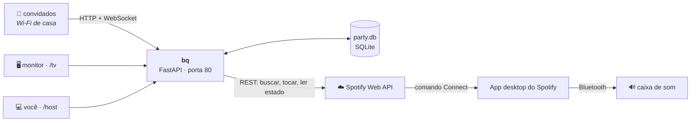

# bq — Birthday Queue

Jukebox colaborativo de festa. Os convidados entram numa página pelo Wi-Fi de casa, buscam
música no Spotify e a fila anda sozinha — alternando entre as pessoas, sem ninguém precisar
mexer no notebook. Cinco votos pulam a faixa atual. Um monitor mostra o que está tocando e o QR
para entrar.

Feito para **uma noite, ~30 pessoas, uma máquina**. Não é um produto: é um app de festa, e várias
decisões só fazem sentido nessa escala. Elas estão registradas em [.docs/](.docs/) com o porquê.

---

## Como funciona

O `bq` **não toca áudio**. Ele é um controle remoto: pede ao Spotify que o **app desktop** toque, via
Spotify Connect. O som sai do app desktop para onde você mandar — no caso, uma caixa Bluetooth.



Duas consequências disso, e as duas importam na prática:

- **nenhum código de áudio, codec ou Bluetooth existe aqui** — a parte de onde o som sai é sua, com
  o app desktop;
- **playback depende de internet.** Sem rede não há busca nem troca de faixa. O que já estava
  tocando continua.

Racional completo em
[ADR-001](.docs/adr/ADR-001-spotify-connect-vs-web-playback-sdk.md).

## O que você precisa

| | |
|---|---|
| **Spotify Premium** | a API de playback só funciona com Premium. Sem plano B |
| **App desktop do Spotify** | aberto e logado na máquina que roda o `bq`. É ele que toca |
| **Um app registrado** no [dashboard do Spotify](https://developer.spotify.com/dashboard) | Development Mode serve |
| **Python 3.13** e **Node 22** | verificados nesta máquina: 3.13.5 e 22.22.2 |
| **Wi-Fi** com o notebook e os celulares na mesma rede | sem internet exposta, sem porta encaminhada |

---

## Setup — uma vez

### 1. Registre o app no Spotify

No dashboard, crie um app e anote `Client ID` e `Client Secret`. Em **Redirect URIs**, adicione
exatamente:

```
http://127.0.0.1:8888/callback
```

> 🔴 **`localhost` não funciona.** O Spotify recusa `localhost` como redirect URI e exige IP
> literal de loopback. O erro que ele devolve é `INVALID_CLIENT: Invalid redirect URI`, que não
> menciona isso e manda você conferir o `client_id` — e a maioria dos tutoriais na internet ensina
> errado, porque a regra endureceu depois. Tem de ser **byte a byte** igual, barra final incluída.

### 2. Preencha o `.env`

```powershell
copy api\.env.example api\.env
notepad api\.env
```

| Chave | O que é |
|---|---|
| `SPOTIFY_CLIENT_ID` / `SPOTIFY_CLIENT_SECRET` | do dashboard |
| `SPOTIFY_REDIRECT_URI` | o mesmo do passo 1 |
| `SPOTIFY_DEVICE_NAME` | nome com que o app desktop aparece — normalmente o nome do computador |
| `HOST_PIN` | 4 dígitos, para abrir o `/host` |
| `WIFI_SSID` / `WIFI_PASSWORD` | a rede da festa, para o QR de conexão do `/tv`. Opcional — vazio esconde esse QR |

Se faltar alguma chave, o boot **aborta com mensagem legível** dizendo qual. Descobrir que o PIN não
estava setado às 21h, com convidados chegando, é pior que não subir às 18h.

Limiares do jogo (5 votos, 2 min de espera, duração máxima) **não** ficam no `.env`: vivem no banco,
porque o `/host` ajusta ao vivo.

### 3. Instale as dependências

```powershell
cd api
python -m venv .venv
.\.venv\Scripts\pip install -e .
cd ..\web
npm install
cd ..
```

Quatro dependências de runtime no backend (`fastapi`, `uvicorn`, `httpx`, `pydantic-settings`).
Nada com extensão C além do que já vem no CPython — é o que faz o `pip install` funcionar na
primeira tentativa.

### 4. Autorize o Spotify

Abra o **app desktop do Spotify** e logue na conta Premium. Então:

```powershell
cd api
.\.venv\Scripts\python scripts\authorize.py
```

Abre o browser, você autoriza, e ele grava `api\.tokens.json`. No fim, o script **lista os devices
visíveis** e diz se achou o seu — é a diferença entre descobrir um nome errado agora e descobrir na
primeira música da festa.

Roda uma vez. Depois o servidor renova o token sozinho.

---

## Rodando

```powershell
.\start.ps1
```

Ele builda o frontend se algo mudou, confere a porta, e imprime em destaque as três URLs:

```
   convidados  ->  http://192.168.0.10
   monitor     ->  http://192.168.0.10/tv
   você        ->  http://192.168.0.10/host
```

`Ctrl+C` encerra. O log completo fica em `api\party.log`.

> Se houver mais de uma rede ativa na máquina, o `start.ps1` lista todas e avisa qual escolheu.
> **Com VPN ligada o IP sai errado** e o QR aponta para um endereço que nenhum celular alcança —
> por isso ele escolhe pelo adaptador (Wi-Fi, DHCP) e não pela rota de saída.

### As três telas

| Tela | Onde | O que é |
|---|---|---|
| `/` | celular dos convidados | apelido, busca, sugerir, votar para pular |
| `/tv` | monitor, em fullscreen | faixa atual, fila, contador de skip, **dois QRs**. **Nada clicável** |
| `/host` | seu notebook | pular, pausar, tocar agora, remover, mover na fila, limiares, saúde |
| `/historico` | qualquer celular | o que já tocou, quem sugeriu, o que foi pulado. Quem votou aparece só para o host |

Para o monitor, Chromium em modo quiosque — sem cursor, sem barra, sem risco de alguém navegar:

```powershell
start chrome --kiosk http://127.0.0.1/tv
```

### Os dois QRs do `/tv`

O monitor mostra um par **numerado**, e a ordem não é decoração:

| | O que faz |
|---|---|
| **1 · entre na rede** | conecta o celular no Wi-Fi de casa. Não é um link: o QR carrega uma string `WIFI:T:WPA;S:…;P:…;;`, que a câmera nativa do iOS 11+ e do Android 10+ reconhece e oferece "conectar-se à rede" |
| **2 · escolha a música** | abre a página dos convidados |

Sem a numeração, quem acaba de chegar escaneia o segundo primeiro, ainda não está na rede, e
recebe um erro de conexão — que na experiência dele é a festa estar quebrada. Se `WIFI_SSID`
estiver vazio no `.env`, o primeiro QR simplesmente não aparece.

O `start.ps1` compara o `WIFI_SSID` com a rede em que o notebook está de fato e avisa se
divergirem: o QR mandando os convidados para a rede errada é uma falha em que escanear funciona,
conectar funciona, e só o servidor fica inalcançável.

---

## As regras do jogo

Todas ajustáveis no `/host` durante a festa, com efeito imediato.

| Regra | Padrão | Por quê |
|---|---|---|
| **A fila alterna entre pessoas** | — | quem pede 3 músicas não toca 3 seguidas. Todo primeiro pedido de todo mundo vem antes de qualquer segundo pedido |
| Uma sugestão aceita por pessoa | a cada **2 min** | sem isso, quem digita mais rápido controla a festa. Tentativa recusada não gasta a vez |
| **5 votos pulam** a faixa | 5 | o voto vale para a execução atual e não expira. Trocou a música, os votos deixam de existir |
| Voto só depois de ouvir um pouco | **20 s** | e não nos últimos 15 s, e não nos 45 s depois de um skip. Ajustável no `/host` |
| Retirar o voto | sempre | sem exceção, mesmo durante proteção ou cooldown |
| Mesma faixa duas vezes na fila | proibido | contra acidente: três pessoas amam a mesma música |
| Faixa que já tocou | libera em **90 min** | às 2h da manhã, a música que abriu a festa é a que a sala quer de novo |
| Duração máxima | **7 min** | contra travar a pista sem querer |
| "Tocar agora" do host | protege **90 s** | o caso concreto é a música do bolo sendo pulada por 5 pessoas em 8 segundos |
| Fila vazia | **silêncio** | e o `/tv` enche a tela chamando para sugerir. A saída manual é o "tocar agora" |

O PIN do `/host` **não é segurança** — é design de jogo. Com o `/host` aberto, forçar uma música é
sempre mais rápido que convencer 4 pessoas a votar, e no momento em que duas pessoas descobrem
isso a votação e a fila justa viram enfeite. Ver
[ADR-007](.docs/adr/ADR-007-escopo-de-seguranca-reduzido.md).

---

## Quando algo dá errado

| Sintoma | O que fazer |
|---|---|
| **Nada toca, mas a fila anda** | o app desktop do Spotify fechou ou deslogou. Reabra e clique em **"Reabri o Spotify, procurar o device"** no `/host` |
| **O `/tv` diz "a fila está esperando"** | alguém deu play em outro aparelho na mesma conta 3 vezes e o sistema desistiu de brigar. Feche o Spotify do celular e clique em **"Resolvi — voltar a tocar a fila"** no `/host` |
| **Convidado não abre a página** | confira se o IP impresso é o do Wi-Fi (VPN desligada) e se o celular está na mesma rede |
| **Pediram o apelido de novo** | cookie limpo. Só reentrar — mas o tempo de espera dele zerou |
| **Volume salta entre músicas** | o Spotify não normaliza volume em device de terceiros. Ajuste na caixa |
| **`invariantes` com algo diferente de 0 no `/host`** | um bug de estado. O runbook tem o que olhar |

Playbook completo, sintoma por sintoma: [.docs/11-runbook-da-festa.md](.docs/11-runbook-da-festa.md).

---

## Estado atual

| Milestone | Situação |
|---|---|
| **M0 — toca** | pronto. Sugestão do celular → faixa toca → a próxima entra sozinha |
| **M1 — o jogo** | pronto. Fila justa, votação, `/tv`, `/host` completo, WebSocket |
| **M2 — acabamento** | pronto. Modo passivo, retomada após restart, mover na fila, `/historico`, animações |
| **M2.9 — park/resume** | **não vai ser feito.** A faixa interrompida por "tocar agora" recomeça do início, e isso é decisão e não pendência ([ADR-008](.docs/adr/ADR-008-force-play-simples-vs-park-resume.md)): 3 h de máquina de estados para trocar um comportamento aceitável por um elegante, num app de uma noite |

Duas coisas **ainda não foram exercitadas contra o Spotify de verdade** — só contra um duplo de
teste com latência injetada:

1. **o caminho do áudio ponta a ponta.** Toda a lógica tem teste, mas o primeiro `PUT` real ainda
   vai acontecer;
2. **`DISPATCH_LEAD_MS`.** A constante que decide o silêncio entre faixas está em `150` ms, que é um
   palpite fundamentado e não uma medição. Alto demais corta o final das músicas; baixo demais
   devolve o silêncio. Ajuste em [`api/bq/playback/conductor.py`](api/bq/playback/conductor.py) com a caixa ligada e
   um cronômetro — o log imprime `play=N confirmado em X ms`, que é metade da medição.

---

## Desenvolvimento

```powershell
# testes (104, sem rede e sem caixa de som — uma festa inteira roda em segundos)
cd api
.\.venv\Scripts\pip install -e ".[dev]"
.\.venv\Scripts\python -m pytest

# frontend com HMR, em :5173, com proxy de /api e /ws para a :80
cd web
npm run dev
```

O build do frontend regenera os tipos a partir do OpenAPI do pydantic, então **renomear um campo no
backend quebra `npm run build`** em vez de falhar em runtime na festa.

### Estrutura

```
birthday-queue/
├── .docs/            a especificação — 22 páginas + 10 ADRs
├── api/
│   ├── bq/           o servidor, em seis camadas com uma ordem total:
│   │   ├── core/         relógio, config, banco, log, rede, erro
│   │   ├── spotify/      HTTP contra o Spotify; não conhece o banco
│   │   ├── domain/       as regras da festa: convidado, faixa, fila, play, guardas
│   │   ├── view/         o que as TELAS recebem: snapshot, histórico, websocket
│   │   ├── playback/     o que a CAIXA DE SOM recebe: o maestro e o voto
│   │   └── routes/       a porta HTTP. Nada importa daqui
│   ├── scripts/      authorize.py (OAuth) e dump_openapi.py (contrato)
│   └── tests/        espelha bq/, com relógio e Spotify falsos
├── web/src/          Vue 3 + TS. views/ tem as quatro telas
└── start.ps1
```

Cada pasta importa das de baixo, nunca das de cima, e há um teste que falha no commit que quebrar
isso. O docstring de [`api/bq/__init__.py`](api/bq/__init__.py) tem o mapa e as sete regras — é a
porta de entrada; o porquê de cada fronteira está em
[ADR-010](.docs/adr/ADR-010-camadas-do-backend.md).

Os quatro arquivos que valem ler antes de mexer em qualquer coisa:

| Arquivo | Por quê |
|---|---|
| [`api/bq/core/clock.py`](api/bq/core/clock.py) | as duas únicas funções de tempo do sistema. Ler o comentário não é opcional |
| [`api/bq/playback/conductor.py`](api/bq/playback/conductor.py) | o maestro: uma task decide o que toca. Tudo depende dele |
| [`api/bq/core/schema.sql`](api/bq/core/schema.sql) | quatro regras de negócio moram nos índices, não no código |
| [`web/src/types/ws.ts`](web/src/types/ws.ts) | a fonte da verdade do protocolo de tempo real |

### A especificação

[.docs/README.md](.docs/README.md) é o índice. Se você só vai ler uma coisa, leia
[.docs/03-arquitetura.md §4](.docs/03-arquitetura.md) — o maestro. Se vai mexer em fila ou voto, leia
antes [.docs/04-modelo-de-dados.md §4](.docs/04-modelo-de-dados.md) e
[.docs/05-api-http.md §4](.docs/05-api-http.md): são os dois lugares onde um erro é silencioso.

Os ADRs registram as decisões que parecem estranhas e o que aconteceria se fossem revertidas.
