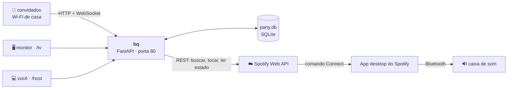
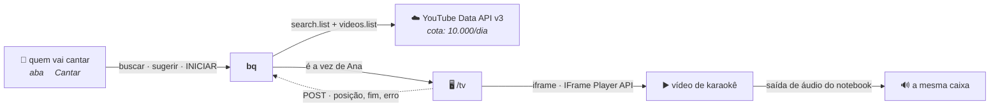

# bq — Birthday Queue

Jukebox colaborativo de festa. Os convidados entram numa página pelo Wi-Fi de casa, buscam
música no Spotify e a fila anda sozinha — alternando entre as pessoas, sem ninguém precisar
mexer no notebook. Cinco votos pulam a faixa atual. Um monitor mostra o que está tocando e o QR
para entrar.

Feito para **uma noite, ~30 pessoas, uma máquina**. Não é um produto: é um app de festa, e várias
decisões só fazem sentido nessa escala. Elas estão registradas em [.docs/](.docs/) com o porquê.

---

## Como funciona

O `bq` **não toca áudio**. Ele é um controle remoto: pede ao Spotify que o **app desktop** toque, via
Spotify Connect. O som sai do app desktop para onde você mandar — no caso, uma caixa Bluetooth.



Duas consequências disso, e as duas importam na prática:

- **nenhum código de áudio, codec ou Bluetooth existe aqui** — a parte de onde o som sai é sua, com
  o app desktop;
- **playback depende de internet.** Sem rede não há busca nem troca de faixa. O que já estava
  tocando continua.

Racional completo em
[ADR-001](.docs/adr/ADR-001-spotify-connect-vs-web-playback-sdk.md).

### E o karaokê

Tem também: o convidado abre a aba **🎤 Cantar**, escolhe um vídeo de karaokê, e quando chega a vez
a `/tv` **chama a pessoa pelo nome e espera**. Ela toca INICIAR no próprio celular, o vídeo toca num
iframe da própria `/tv` — instrumental e letra sincronizada vêm no vídeo —, e no fim aparece
"Parabéns!" antes de a fila normal continuar.

O Spotify não participa disso, e não é escolha: **não existe remoção de voz na API dele, e não
existe endpoint de letra.** Um vídeo de karaokê do YouTube já traz as duas coisas na mesma imagem,
o que faz o problema de sincronia desaparecer em vez de ser resolvido. O servidor continua dono do
relógio — se a `/tv` fechar ou travar, o teto vence, o Spotify volta e a festa continua. Racional
inteiro em [ADR-011](.docs/adr/ADR-011-karaoke-na-tv.md).



A linha pontilhada é **telemetria, não comando**: ela refina a posição, não decide o que toca. O
teto do turno é do servidor, então uma `/tv` que trave ou feche não trava a festa — o prazo vence,
o Spotify volta e a fila segue.

A fila é **uma só**: um karaokê é uma linha de `track` com `provider='karaoke'`, e portanto reusa
histórico, cooldown, limite de duração e "faixa repetida" sem nenhum caminho paralelo. O que a
tela do convidado mostra em duas abas, o banco guarda numa fila só, intercalada por *um karaokê a
cada N músicas*.

Nasce **desligado**. Para ligar, são três coisas — chave, perfil do navegador e um interruptor no
`/host` — e duas delas convém fazer na véspera: [Setup §5](#5-karaokê--opcional-mas-faça-na-véspera).
Como funciona por dentro: [.docs/12](.docs/12-integracao-youtube.md). O que fazer quando falha, na
festa: [.docs/11 §1.1 e §3.10](.docs/11-runbook-da-festa.md).

## O que você precisa

| | |
|---|---|
| **Spotify Premium** | a API de playback só funciona com Premium. Sem plano B |
| **App desktop do Spotify** | aberto e logado na máquina que roda o `bq`. É ele que toca |
| **Um app registrado** no [dashboard do Spotify](https://developer.spotify.com/dashboard) | Development Mode serve |
| **Python 3.13** e **Node 22** | verificados nesta máquina: 3.13.5 e 22.22.2 |
| **Wi-Fi** com o notebook e os celulares na mesma rede | sem internet exposta, sem porta encaminhada |
| *só para o karaokê:* **chave da YouTube Data API v3** | grátis, sem OAuth. Sem ela o karaokê fica desligado e o resto funciona igual |
| *só para o karaokê:* **conta com YouTube Premium** | não é do `bq`, é do navegador da TV. Sem ela toca anúncio na frente de quem ia cantar, e não há como pular |

---

## Setup — uma vez

### 1. Registre o app no Spotify

No dashboard, crie um app e anote `Client ID` e `Client Secret`. Em **Redirect URIs**, adicione
exatamente:

```
http://127.0.0.1:8888/callback
```

> 🔴 **`localhost` não funciona.** O Spotify recusa `localhost` como redirect URI e exige IP
> literal de loopback. O erro que ele devolve é `INVALID_CLIENT: Invalid redirect URI`, que não
> menciona isso e manda você conferir o `client_id` — e a maioria dos tutoriais na internet ensina
> errado, porque a regra endureceu depois. Tem de ser **byte a byte** igual, barra final incluída.

### 2. Preencha o `.env`

```powershell
copy api\.env.example api\.env
notepad api\.env
```

| Chave | O que é |
|---|---|
| `SPOTIFY_CLIENT_ID` / `SPOTIFY_CLIENT_SECRET` | do dashboard |
| `SPOTIFY_REDIRECT_URI` | o mesmo do passo 1 |
| `SPOTIFY_DEVICE_NAME` | nome com que o app desktop aparece — normalmente o nome do computador |
| `HOST_PIN` | 4 dígitos, para abrir o `/host` |
| `WIFI_SSID` / `WIFI_PASSWORD` | a rede da festa, para o QR de conexão do `/tv`. Opcional — vazio esconde esse QR |
| `YOUTUBE_API_KEY` | o karaokê. Opcional — vazio desliga a feature inteira (passo 5) |

Se faltar alguma chave, o boot **aborta com mensagem legível** dizendo qual. Descobrir que o PIN não
estava setado às 21h, com convidados chegando, é pior que não subir às 18h.

As duas últimas são a exceção, e a ausência delas é **aditiva**: sem `WIFI_SSID` o `/tv` mostra um
QR em vez de dois; sem `YOUTUBE_API_KEY` a aba 🎤 Cantar não existe. Configuração *incoerente* é
que merece abortar — ausente é uma escolha legítima de quem não quer aquilo.

Limiares do jogo (5 votos, 2 min de espera, duração máxima) **não** ficam no `.env`: vivem no banco,
porque o `/host` ajusta ao vivo.

### 3. Instale as dependências

```powershell
cd api
python -m venv .venv
.\.venv\Scripts\pip install -e .
cd ..\web
npm install
cd ..
```

Quatro dependências de runtime no backend (`fastapi`, `uvicorn`, `httpx`, `pydantic-settings`).
Nada com extensão C além do que já vem no CPython — é o que faz o `pip install` funcionar na
primeira tentativa.

### 4. Autorize o Spotify

Abra o **app desktop do Spotify** e logue na conta Premium. Então:

```powershell
cd api
.\.venv\Scripts\python scripts\authorize.py
```

Abre o browser, você autoriza, e ele grava `api\.tokens.json`. No fim, o script **lista os devices
visíveis** e diz se achou o seu — é a diferença entre descobrir um nome errado agora e descobrir na
primeira música da festa.

Roda uma vez. Depois o servidor renova o token sozinho.

### 5. Karaokê — opcional, mas **faça na véspera**

Pule tudo isto se não vai ter karaokê: nada aqui é pré-requisito para o resto. Se vai, os dois
primeiros passos precisam de antecedência — um exige um login, o outro depende do Google.

**5.1 · A chave.** No [console do Google Cloud](https://console.cloud.google.com): criar projeto →
**APIs e serviços** → ativar **YouTube Data API v3** → **Credenciais** → *Criar credenciais* →
**Chave de API**. Não há OAuth nem conta ligada — quem chama é o backend, sem usuário. Cole o valor
inteiro em `api\.env`, na linha `YOUTUBE_API_KEY=`, e **reinicie o `start.ps1`**: o `Settings` é
lido no import, não há releitura a quente.

> A chave do Google tem **39 caracteres** e começa com `AIza`. Se você colou algo mais curto — um
> `AIza...` abreviado, por exemplo —, o Google responde `400 badRequest` / *"API key not valid"*, o
> `bq` desliga o cliente **pelo resto do processo**, e os convidados leem "O karaokê está fora do
> ar". Corrigir o `.env` não basta: tem de reiniciar.

> Ao restringir a chave, use **restrição de API** (só *YouTube Data API v3*). Não restrinja por IP
> nem por referenciador: quem chama é um servidor num IP residencial dinâmico, e a chamada morre no
> meio da festa quando a operadora trocar o endereço.

**5.2 · O perfil da TV, com Premium.** Rode uma vez, em casa:

```powershell
.\start.ps1 -Tv
```

Na **primeira** execução o Chrome abre **sem** quiosque, de propósito: **entre na conta com YouTube
Premium** e feche. A sessão fica no perfil dedicado `.chrome-tv\`, que é gitignored — lá dentro há
cookie de sessão logada em texto claro.

**5.3 · Ligar.** `/host` → **Regras** → **Karaokê na fila** = *a cada 3 músicas*. Nasce
**desligado**, e são **duas metades**: existir chave **e** o host ter ligado. Só uma das duas não
faz a aba 🎤 Cantar aparecer no celular de ninguém.

Não coloque "a cada 1" — a festa vira open mic e quem só queria ouvir música nunca é atendido.

**5.4 · O teste que vale.** Do **celular, pela Wi-Fi**: aba 🎤 **Cantar**, escolher um vídeo,
esperar o próprio nome aparecer no telão, tocar **INICIAR**. Se o som sair na caixa, está tudo de pé.

> 🔴 **A cota é o recurso escasso, e testar hoje gasta a cota de hoje.** Cada busca não cacheada
> custa **101** das **10.000** unidades diárias — cerca de **99 buscas para a festa inteira**, com
> trinta convidados. O `bq` cacheia por 6 h e para sozinho em 9.000, degradando para "a busca está
> ocupada" em vez de morrer. A cota zera à meia-noite do Pacífico, ou seja, de madrugada aqui.
> O consumo aparece em `/host` → Saúde.

Detalhe de como a integração funciona por dentro — endpoints, cota, cache, os erros e o iframe:
[.docs/12-integracao-youtube.md](.docs/12-integracao-youtube.md).

---

## Rodando

```powershell
.\start.ps1
```

Ele builda o frontend se algo mudou, confere a porta, e imprime em destaque as três URLs:

```
   convidados  ->  http://192.168.0.10
   monitor     ->  http://192.168.0.10/tv
   você        ->  http://192.168.0.10/host
```

`Ctrl+C` encerra. O log completo fica em `api\party.log`.

> Se houver mais de uma rede ativa na máquina, o `start.ps1` lista todas e avisa qual escolheu.
> **Com VPN ligada o IP sai errado** e o QR aponta para um endereço que nenhum celular alcança —
> por isso ele escolhe pelo adaptador (Wi-Fi, DHCP) e não pela rota de saída.

### As quatro telas

| Tela | Onde | O que é |
|---|---|---|
| `/` | celular dos convidados | apelido, busca, sugerir, votar para pular — e a aba 🎤 Cantar, se o karaokê estiver ligado |
| `/tv` | monitor, em fullscreen | faixa atual, fila, contador de skip, **dois QRs** — e a chamada do cantor e o vídeo, no karaokê. **Nada clicável** |
| `/host` | seu notebook | pular, pausar, tocar agora, remover, mover na fila, limiares, saúde |
| `/historico` | qualquer celular | o que já tocou, quem sugeriu, o que foi pulado. Quem votou aparece só para o host |

Para o monitor, use o switch — ele abre o Chrome em quiosque, sem cursor e sem barra, **e com os
flags de autoplay** que o karaokê exige:

```powershell
.\start.ps1 -Tv
```

> 🔴 **Não abra a `/tv` com `start chrome --kiosk http://127.0.0.1/tv`.** Se o Chrome já estiver
> aberto no seu perfil normal, esse comando entrega a URL ao processo existente e **descarta todos
> os flags** — inclusive o do autoplay. Não há erro: o vídeo do karaokê simplesmente fica parado com
> o nome da pessoa no telão. O `-Tv` usa `--user-data-dir` próprio justamente por isso, e **imprime
> a linha de comando completa sempre**, com ou sem o switch, para o caminho manual ser um
> copiar-e-colar.

### Os dois QRs do `/tv`

O monitor mostra um par **numerado**, e a ordem não é decoração:

| | O que faz |
|---|---|
| **1 · entre na rede** | conecta o celular no Wi-Fi de casa. Não é um link: o QR carrega uma string `WIFI:T:WPA;S:…;P:…;;`, que a câmera nativa do iOS 11+ e do Android 10+ reconhece e oferece "conectar-se à rede" |
| **2 · escolha a música** | abre a página dos convidados |

Sem a numeração, quem acaba de chegar escaneia o segundo primeiro, ainda não está na rede, e
recebe um erro de conexão — que na experiência dele é a festa estar quebrada. Se `WIFI_SSID`
estiver vazio no `.env`, o primeiro QR simplesmente não aparece.

O `start.ps1` compara o `WIFI_SSID` com a rede em que o notebook está de fato e avisa se
divergirem: o QR mandando os convidados para a rede errada é uma falha em que escanear funciona,
conectar funciona, e só o servidor fica inalcançável.

---

## As regras do jogo

Todas ajustáveis no `/host` durante a festa, com efeito imediato.

| Regra | Padrão | Por quê |
|---|---|---|
| **A fila alterna entre pessoas** | — | quem pede 3 músicas não toca 3 seguidas. Todo primeiro pedido de todo mundo vem antes de qualquer segundo pedido |
| Uma sugestão aceita por pessoa | a cada **2 min** | sem isso, quem digita mais rápido controla a festa. Tentativa recusada não gasta a vez |
| **5 votos pulam** a faixa | 5 | o voto vale para a execução atual e não expira. Trocou a música, os votos deixam de existir |
| Voto só depois de ouvir um pouco | **20 s** | e não nos últimos 15 s, e não nos 45 s depois de um skip. Ajustável no `/host` |
| Retirar o voto | sempre | sem exceção, mesmo durante proteção ou cooldown |
| Mesma faixa duas vezes na fila | proibido | contra acidente: três pessoas amam a mesma música |
| Faixa que já tocou | libera em **90 min** | às 2h da manhã, a música que abriu a festa é a que a sala quer de novo |
| Duração máxima | **7 min** | contra travar a pista sem querer |
| "Tocar agora" do host | protege **90 s** | o caso concreto é a música do bolo sendo pulada por 5 pessoas em 8 segundos |
| Fila vazia | **silêncio** | e o `/tv` enche a tela chamando para sugerir. A saída manual é o "tocar agora" |
| **Karaokê na fila** | **desligado** | ligado, entra um karaokê a cada N músicas normais. Muito baixo e a festa vira open mic |
| Espera do cantor | **45 s** | vencido o prazo, a vez volta para o fim da fila e a fila anda. Ninguém fica de pé esperando alguém que foi ao banheiro |
| Quem canta **não pode ser pulado** | — | não é uma flag: durante um turno o botão de pular não existe na tela. Cinco pessoas calarem quem está no microfone é outra coisa que pular uma música |

O PIN do `/host` **não é segurança** — é design de jogo. Com o `/host` aberto, forçar uma música é
sempre mais rápido que convencer 4 pessoas a votar, e no momento em que duas pessoas descobrem
isso a votação e a fila justa viram enfeite. Ver
[ADR-007](.docs/adr/ADR-007-escopo-de-seguranca-reduzido.md).

---

## Quando algo dá errado

| Sintoma | O que fazer |
|---|---|
| **Nada toca, mas a fila anda** | o app desktop do Spotify fechou ou deslogou. Reabra e clique em **"Reabri o Spotify, procurar o device"** no `/host` |
| **O `/tv` diz "a fila está esperando"** | alguém deu play em outro aparelho na mesma conta 3 vezes e o sistema desistiu de brigar. Feche o Spotify do celular e clique em **"Resolvi — voltar a tocar a fila"** no `/host` |
| **Convidado não abre a página** | confira se o IP impresso é o do Wi-Fi (VPN desligada) e se o celular está na mesma rede |
| **Pediram o apelido de novo** | cookie limpo. Só reentrar — mas o tempo de espera dele zerou |
| **Volume salta entre músicas** | o Spotify não normaliza volume em device de terceiros. Ajuste na caixa |
| **`invariantes` com algo diferente de 0 no `/host`** | um bug de estado. O runbook tem o que olhar |
| **O nome está no telão e não sai som** | `/host` → Saúde → Karaokê separa as três causas em dois segundos. Se a `/tv` está aberta e não reporta, o navegador barrou o autoplay: **aperte a barra de espaço na máquina da TV** |
| **A aba 🎤 Cantar não aparece no celular** | falta uma das duas metades: `YOUTUBE_API_KEY` no `.env` (com restart) ou `/host` → Regras → *Karaokê na fila* |
| **A busca de karaokê diz que está ocupada** | a cota diária do YouTube acabou. Só a busca de karaokê para; a fila normal não é afetada, e volta na virada do dia no Pacífico |
| **A segunda `/tv` não faz som** | é de propósito ([RF-51](.docs/01-requisitos-funcionais.md)): só uma tela toca, senão a sala ouve dois players dessincronizados. Feche a que não é a do monitor |

Playbook completo, sintoma por sintoma: [.docs/11-runbook-da-festa.md](.docs/11-runbook-da-festa.md).

---

## Estado atual

| Milestone | Situação |
|---|---|
| **M0 — toca** | pronto. Sugestão do celular → faixa toca → a próxima entra sozinha |
| **M1 — o jogo** | pronto. Fila justa, votação, `/tv`, `/host` completo, WebSocket |
| **M2 — acabamento** | pronto. Modo passivo, retomada após restart, mover na fila, `/historico`, animações |
| **M3 — karaokê** | pronto. Aba 🎤 Cantar no celular, chamada pelo nome na `/tv`, vídeo no iframe, "Parabéns", e a fila normal voltando sozinha |
| **M2.9 — park/resume** | **não vai ser feito.** A faixa interrompida por "tocar agora" recomeça do início, e isso é decisão e não pendência ([ADR-008](.docs/adr/ADR-008-force-play-simples-vs-park-resume.md)): 3 h de máquina de estados para trocar um comportamento aceitável por um elegante, num app de uma noite |

Duas coisas **ainda não foram exercitadas contra o Spotify de verdade** — só contra um duplo de
teste com latência injetada:

1. **o caminho do áudio ponta a ponta.** Toda a lógica tem teste, mas o primeiro `PUT` real ainda
   vai acontecer;
2. **`DISPATCH_LEAD_MS`.** A constante que decide o silêncio entre faixas está em `150` ms, que é um
   palpite fundamentado e não uma medição. Alto demais corta o final das músicas; baixo demais
   devolve o silêncio. Ajuste em [`api/bq/playback/conductor.py`](api/bq/playback/conductor.py) com a caixa ligada e
   um cronômetro — o log imprime `play=N confirmado em X ms`, que é metade da medição.

---

## Desenvolvimento

```powershell
# frontend com HMR, em :5173, com proxy de /api e /ws para a :80
cd web
npm run dev
```

O build do frontend regenera os tipos a partir do OpenAPI do pydantic, então **renomear um campo no
backend quebra `npm run build`** em vez de falhar em runtime na festa.

### Rodando os testes

Preparação, uma vez cada:

```powershell
cd api
.\.venv\Scripts\pip install -e ".[dev]"     # pytest e mypy

cd ..\web
npx playwright install chromium             # ~130 MB, só para as suítes de tela
```

| Comando | O que roda | Precisa de |
|---|---|---|
| `cd api; .\.venv\Scripts\python -m pytest -q` | 241 testes de mesa: fila, votação, maestro, turno de karaokê, invariantes, camadas | nada |
| `cd api; .\.venv\Scripts\python -m mypy` | 42 arquivos. `strict` nos 5 módulos com aritmética de tempo | nada |
| `cd web; npm run build` | **é o typecheck do frontend**, não só o bundle | nada |
| `cd web; npm test` | 42 testes das telas, ~20 s | o Chromium acima |
| `cd web; npm run test:festa` | 9 testes full-stack, ~1 min | o Chromium, a venv **e** um `npm run build` antes |

**Nenhum deles precisa de internet, do Spotify autorizado, do YouTube ou da caixa ligada.** A
IFrame API do YouTube também tem duplo, servido no lugar do script real dentro do browser. Uma festa inteira
de 20 faixas roda em segundos, porque o relógio é injetável e o Spotify tem duplo.

**`npm test` — a suíte isolada.** Sobe o Vite e intercepta todo o tráfego dentro do browser: não
existe API, nem banco, nem Spotify. Ela cobre o que uma tela *conclui* a partir do estado — o botão
de pular que se libera sozinho quando a carência vence sem chegar mensagem nenhuma do servidor, e a
diferença entre "a fila está vazia" e "o anfitrião pausou", que são situações distintas e a tela
não pode confundir na frente da sala.

**`npm run test:festa` — a suíte full-stack.** Sobe o `bq` inteiro num uvicorn de verdade na
:8099, servindo as telas e a API na mesma origem, com o Spotify substituído por um duplo e o banco
num diretório temporário. É o que permite verificar "5 votos pulam" de fato: cada convidado é um
*browser context* com o seu próprio cookie, que é o equivalente a cinco celulares.

> 🔴 O servidor de teste **nunca** toca `api\party.db` — ele recusa subir se a configuração apontar
> para dentro de `api\`. Aquele arquivo tem o histórico real das festas passadas e não há cópia.

Se a suíte de festa falhar logo no começo com 503, faltou `npm run build`: quem serve as telas ali
é o FastAPI, a partir de `web\dist`.

O que **não** dá para automatizar continua no checklist manual de
[.docs/10 §4](.docs/10-testes-e-validacao.md) — o silêncio entre faixas, o zoom ao focar a busca no
iPhone, o salto de volume da JBL entre uma música antiga e uma moderna. Dependem de hardware, de
outro aparelho, ou de gente.

### Estrutura

```
birthday-queue/
├── .docs/            a especificação — 13 páginas numeradas + 11 ADRs
├── api/
│   ├── bq/           o servidor, em sete camadas com uma ordem total:
│   │   ├── core/         relógio, config, banco, log, rede, erro
│   │   ├── spotify/      HTTP contra o Spotify; não conhece o banco
│   │   ├── youtube/      HTTP contra o YouTube, para o karaokê. Irmã de spotify/
│   │   ├── domain/       as regras da festa: convidado, faixa, fila, play, guardas, turno
│   │   ├── view/         o que as TELAS recebem: snapshot, histórico, websocket
│   │   ├── playback/     o que a CAIXA DE SOM recebe: o maestro e o voto
│   │   └── routes/       a porta HTTP. Nada importa daqui
│   ├── scripts/      authorize.py (OAuth), dump_openapi.py (contrato) e os duplos de mesa
│   └── tests/        espelha bq/, com relógio, Spotify e YouTube falsos
├── web/
│   ├── src/          Vue 3 + TS. views/ tem as quatro telas
│   └── testes/       Playwright: isolado/ (telas) e festa/ (full-stack)
└── start.ps1
```

Cada pasta importa das de baixo, nunca das de cima, e há um teste que falha no commit que quebrar
isso. O docstring de [`api/bq/__init__.py`](api/bq/__init__.py) tem o mapa e as oito regras — é a
porta de entrada; o porquê de cada fronteira está em
[ADR-010](.docs/adr/ADR-010-camadas-do-backend.md). `spotify/` e `youtube/` **empatam** no mesmo
nível, e a regra R8 — nenhuma das duas importa a outra — existe porque a checagem de nível só
reprova import "para cima": um empate passaria por ela em silêncio.

Os quatro arquivos que valem ler antes de mexer em qualquer coisa:

| Arquivo | Por quê |
|---|---|
| [`api/bq/core/clock.py`](api/bq/core/clock.py) | as duas únicas funções de tempo do sistema. Ler o comentário não é opcional |
| [`api/bq/playback/conductor.py`](api/bq/playback/conductor.py) | o maestro: uma task decide o que toca. Tudo depende dele |
| [`api/bq/core/schema.sql`](api/bq/core/schema.sql) | quatro regras de negócio moram nos índices, não no código |
| [`web/src/types/ws.ts`](web/src/types/ws.ts) | a fonte da verdade do protocolo de tempo real |

### A especificação

[.docs/README.md](.docs/README.md) é o índice. Se você só vai ler uma coisa, leia
[.docs/03-arquitetura.md §4](.docs/03-arquitetura.md) — o maestro. Se vai mexer em fila ou voto, leia
antes [.docs/04-modelo-de-dados.md §4](.docs/04-modelo-de-dados.md) e
[.docs/05-api-http.md §4](.docs/05-api-http.md): são os dois lugares onde um erro é silencioso.

Os ADRs registram as decisões que parecem estranhas e o que aconteceria se fossem revertidas.
